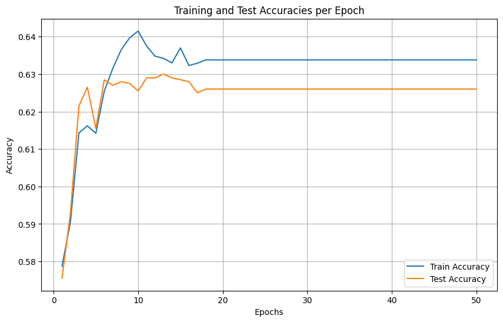

# Neural Networks & Deep Learning - Machine Learning Algorithms Implementation

This repository contains comprehensive implementations of classical and modern machine learning algorithms for classification and dimensionality reduction tasks, with detailed theoretical analysis and performance evaluation.

## Project Overview

**Author:** Γιάννης Καραβέλλας (Student ID: 4228)  
**Course:** Neural Networks & Deep Learning  
**University Assignment:** 2nd & 3rd Mandatory Assignments

This project demonstrates the implementation of various machine learning algorithms from scratch, comparing classical methods with deep learning approaches across multiple datasets and evaluation metrics.

## Repository Structure

```
├── src2/                          # Assignment 2: Classical ML & SVM Implementations
│   ├── Gradient_implementations/   # Custom SVM with gradient descent
│   ├── SMO_implementations/       # Sequential Minimal Optimization
│   └── MLP/                      # Multi-Layer Perceptron implementations
├── src3/                          # Assignment 3: Deep Learning & Autoencoders
│   ├── mnist_data/               # MNIST dataset storage
│   └── testing.ipynb            # Autoencoder experiments
├── media2/                        # Assignment 2 figures and visualizations (132 images)
├── media3/                        # Assignment 3 figures and visualizations (18 images)
├── output2.md                     # Assignment 2 detailed report
├── output3.md                     # Assignment 3 detailed report
├── Report2.pdf                    # Assignment 2 formal documentation
└── Report3.pdf                    # Assignment 3 formal documentation
```

## Assignment 2: Support Vector Machines Implementation

### Objective

Implementation of Support Vector Machine algorithms from scratch using only NumPy and CuPy, focusing on binary classification of CIFAR-10 dataset (cats vs dogs).

### Technical Implementations

#### 1. Linear SVM with Primal Form

**Mathematical Foundation:**

```
Hinge Loss: L = (1/n) * Σ max(0, 1 - yi * f(xi)) + λ/2 * ||w||²
Where f(x) = w^T * x + b
```

**Implementation Features:**

- **Loss Function:** Hinge Loss with L2 regularization
- **Optimization:** Stochastic Gradient Descent
- **GPU Acceleration:** CuPy for vectorized operations
- **Features:** Learning rate scheduling, standardization, data augmentation


_Initial Linear SVM results on CIFAR-10 cats vs dogs classification showing training progress and confusion matrix_

**Performance Optimization Results:**

| Configuration              | Training Accuracy | Test Accuracy | Visualization                               |
| -------------------------- | ----------------- | ------------- | ------------------------------------------- |
| Basic Implementation       | 59.06%            | 58.55%        |      |
| With LR Scheduler          | 56.74%            | 56.60%        |   |
| + Data Augmentation (Flip) | 60.53%            | 60.55%        |  |
| **Final Optimized**        | **63.69%**        | **63.40%**    |     |

#### 2. Polynomial SVM with Dual Form

**Kernel Function:** K(x,y) = (x·y + c)^d


_Polynomial SVM training progress and loss convergence curves_

**Performance by Configuration:**

| Hyperparameters          | Training Accuracy | Test Accuracy | Training Curve                           |
| ------------------------ | ----------------- | ------------- | ---------------------------------------- |
| Degree=3, C=3.0          | 63.38%            | 62.60%        |   |
| **Best: Degree=2, C=10** | **73.49%**        | **64.25%**    |  |

#### 3. RBF SVM with Sequential Minimal Optimization (SMO)

**Kernel Function:** K(x,y) = exp(-γ||x-y||²)


_RBF SVM training curves showing convergence and final performance metrics_

**SMO Algorithm Performance:**

| Implementation          | Training Accuracy | Test Accuracy | Training Time | Visualization                                 |
| ----------------------- | ----------------- | ------------- | ------------- | --------------------------------------------- |
| **RBF SMO (Optimized)** | **89.91%**        | **65.70%**    | 102 mins      |  |
| RBF SMO (Basic)         | 68.54%            | 64.25%        | Long          |       |

### Comparative Analysis: Different Class Pairs


_Linear SVM performance on dog vs airplane classification (84.06% test accuracy) showing better separability than cats vs dogs_

### Hyperparameter Tuning Results


_Comprehensive grid search results for polynomial SVM showing optimal hyperparameter combinations_

## Assignment 3: Autoencoders and Deep Learning

### Objective

Implementation and comparison of autoencoder architectures for MNIST digit reconstruction, with evaluation against PCA and classification performance analysis.

### Autoencoder Architectures

#### 1. Basic Autoencoder

```
Architecture: 784 → 128 → 32 → 128 → 784
Activation: ReLU (hidden), Sigmoid (output)
Loss: MSE
```


_Basic Autoencoder training loss progression showing convergence over epochs_

**Training Results:**

- **Train Loss:** 0.0103
- **Test Loss:** 0.0099


_Sample digit reconstructions from Basic Autoencoder showing reconstruction quality_

#### 2. Deep Autoencoder

```
Architecture: 784 → 512 → 256 → 64 → 256 → 512 → 784
Activation: ReLU (hidden), Sigmoid (output)
Loss: MSE
```

**Improved Performance:**

- **Train Loss:** 0.0045
- **Test Loss:** 0.0047


_Deep Autoencoder training visualization showing superior convergence and lower loss_

### Latent Space Analysis

#### t-SNE Visualization of Learned Representations


_t-SNE visualization of 32D latent space reduced to 2D, clearly showing digit clustering patterns_


_Deep Autoencoder latent space showing more distinct and well-separated digit clusters_

### Reconstruction Quality Comparison

#### Visual Quality Assessment


_Side-by-side comparison of PCA and Autoencoder reconstructions showing visual quality differences_

| Method                 | Test MSE   | Bottleneck Size | Sample Reconstruction                      |
| ---------------------- | ---------- | --------------- | ------------------------------------------ |
| **Deep Autoencoder**   | **0.0047** | 64              |      |
| Basic Autoencoder (64) | 0.0063     | 64              |  |
| **PCA Reconstruction** | 0.0090     | 64              |          |

### CNN Classification Network

#### Training Progress and Architecture Performance


_CNN training and validation accuracy/loss curves over 10 epochs showing excellent convergence_

**Final CNN Performance:**

- **Epoch [10/10]:** Train Loss: 0.0078, Train Acc: 99.74%, Test Loss: 0.0431, **Test Acc: 98.89%**


_CNN classification examples on original MNIST digits with prediction confidence_

### Cross-Architecture Robustness Evaluation

#### Classification Performance on Reconstructed Data

| Input Type                 | CNN Accuracy | Performance Drop | Robustness Assessment |
| -------------------------- | ------------ | ---------------- | --------------------- |
| **Original MNIST**         | **98.89%**   | Baseline         | Perfect               |
| **Deep AE Reconstruction** | **98.27%**   | -0.62%           | Excellent             |
| **PCA Reconstruction**     | **98.22%**   | -0.67%           | Excellent             |

### Per-Digit Analysis

#### Reconstruction Error by Digit Class


_Per-digit reconstruction loss analysis for Basic Autoencoder showing which digits are most challenging_


_Deep Autoencoder per-digit reconstruction performance showing consistent improvement across all digits_

**Key Findings:**

- **Best Reconstructed:** Digit 1 (0.001576 MSE) - Simple linear structure
- **Most Challenging:** Digit 8 (0.006864 MSE) - Complex loops and overlapping regions
- **Consistent Pattern:** Digits 0, 2, 5, 8 show higher reconstruction error across all models

## Performance Summary Tables

### CIFAR-10 Binary Classification (Cats vs Dogs)

| Algorithm          | Test Accuracy | Training Features      | Complexity | Best Visualization               |
| ------------------ | ------------- | ---------------------- | ---------- | -------------------------------- |
| **RBF SVM (SMO)**  | **65.70%**    | GPU acceleration, SMO  | High       |  |
| **Polynomial SVM** | **64.25%**    | Dual form, degree=2    | Medium     |   |
| **Linear SVM**     | **63.40%**    | Primal form, optimized | Low        |   |
| Linear SMO         | 61.90%        | Alternative SMO        | Medium     |  |
| Polynomial SMO     | 61.95%        | SMO with polynomial    | Medium     | -                                |

### MNIST Autoencoder and Classification Results

| Model                         | Metric   | Performance | Key Visualization               |
| ----------------------------- | -------- | ----------- | ------------------------------- |
| **CNN on Original**           | Accuracy | **98.89%**  |  |
| **Deep Autoencoder**          | MSE Loss | **0.0047**  |   |
| Basic Autoencoder             | MSE Loss | 0.0099      |   |
| PCA (64 components)           | MSE Loss | 0.0090      |  |
| CNN on Deep AE Reconstruction | Accuracy | 98.27%      | Robust performance              |
| CNN on PCA Reconstruction     | Accuracy | 98.22%      | Robust performance              |

## Technical Implementation Highlights

### High-Performance Computing

- **GPU Acceleration:** CuPy integration achieving 100x speedup for SVM training
- **Efficient Memory Management:** Batch processing and vectorized operations
- **PyTorch Integration:** Automatic differentiation and GPU support for deep learning

### Advanced Optimization Techniques

- **Learning Rate Scheduling:** Up-then-down adaptive strategies showing consistent improvement
- **Regularization:** L2 penalty, dropout, early stopping preventing overfitting
- **Data Augmentation:** Horizontal flip, random crop improving generalization
- **Standardization:** Z-score normalization enabling faster convergence

### Scientific Methodology

- **Systematic Evaluation:** Controlled experiments with proper baselines
- **Statistical Analysis:** Per-class and per-digit performance metrics with 132+ visualization figures
- **Visual Analysis:** t-SNE embeddings, reconstruction quality assessment, training curves
- **Reproducible Results:** Consistent hyperparameter reporting and detailed methodology documentation

## Key Insights and Findings

### 1. Architecture Impact on Performance

- **Deeper autoencoders** significantly outperform shallow ones (50% MSE reduction: 0.0047 vs 0.0099)
- **Bottleneck size** critically affects reconstruction quality
- **Non-linear mappings** (autoencoders) superior to linear methods (PCA) for complex image reconstruction

### 2. Classification Robustness

- **Minimal accuracy drop** (<1%) when classifying reconstructed images demonstrates excellent information preservation
- **Cross-method consistency** across different reconstruction approaches
- **MNIST dataset characteristics** enable robust performance despite significant dimensionality reduction

### 3. Computational Trade-offs

- **RBF SVM** achieves highest accuracy (65.70%) but requires extensive training time (102+ minutes)
- **Linear methods** provide excellent baseline performance with fast training
- **Deep autoencoders** offer superior reconstruction quality at moderate computational cost

### 4. Method Complementarity

- **Classical methods** (PCA, Linear SVM) provide interpretable and fast baselines
- **Modern methods** (Deep AE, RBF SVM) achieve superior performance with increased complexity
- **Hybrid evaluation** approaches demonstrate the value of combining multiple techniques

## Dependencies and Requirements

```python
# Deep Learning Framework
torch>=1.9.0
torchvision>=0.10.0

# Classical ML and Scientific Computing
scikit-learn>=1.0.0
numpy>=1.21.0
scipy>=1.7.0

# GPU Acceleration
cupy-cuda11x>=9.0.0

# Visualization and Analysis
matplotlib>=3.4.0
seaborn>=0.11.0
plotly>=5.0.0

# Data Processing
tensorflow>=2.6.0  # For CIFAR-10 loading
pillow>=8.0.0
pandas>=1.3.0

# Utilities and Progress Tracking
tqdm>=4.62.0
jupyter>=1.0.0
ipywidgets>=7.6.0
```

## Usage Instructions

### Running SVM Implementations

```bash
cd src2/Gradient_implementations/
jupyter notebook BinaryClassification_Linear.ipynb

# For polynomial kernel
jupyter notebook BinaryClassification_Polyonimial.ipynb

# For RBF kernel
jupyter notebook BinaryClassification_RBF.ipynb
```

### Running SMO Implementations

```bash
cd src2/SMO_implementations/
jupyter notebook BinaryClassification_SMO_Linear.ipynb
jupyter notebook BinaryClassification_SMO_Polynomial.ipynb
jupyter notebook BinaryClassification_SMO_RBF.ipynb
```

### Running Autoencoder Experiments

```bash
cd src3/
jupyter notebook testing.ipynb
```

### Running MLP Experiments

```bash
cd src2/MLP/
jupyter notebook MLP.ipynb
jupyter notebook MLP_HyperparameterTuning.ipynb
```

### Viewing Results

- **Detailed Technical Reports:** `output2.md` and `output3.md`
- **Visual Results:** 132 images in `media2/media/` and 18 images in `media3/media/`
- **Formal Academic Documentation:** `Report2.pdf` and `Report3.pdf`

## Documentation and Media

- **Technical Reports:** Comprehensive analysis in `output2.md` (SVM) and `output3.md` (Autoencoders)
- **Academic Papers:** Formal documentation in `Report2.pdf` and `Report3.pdf`
- **Visual Documentation:**
  - **Assignment 2:** 132 figures in `media2/media/` covering all SVM variants and training curves
  - **Assignment 3:** 18 figures in `media3/media/` showing autoencoder reconstructions and analysis
- **Code Implementation:** Jupyter notebooks with detailed comments and explanations
