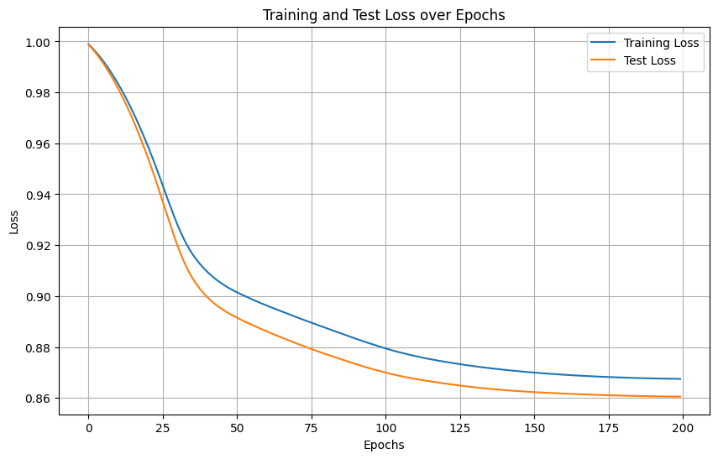
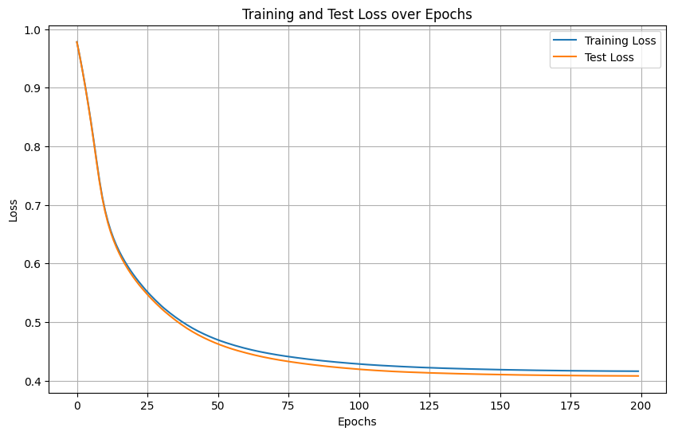
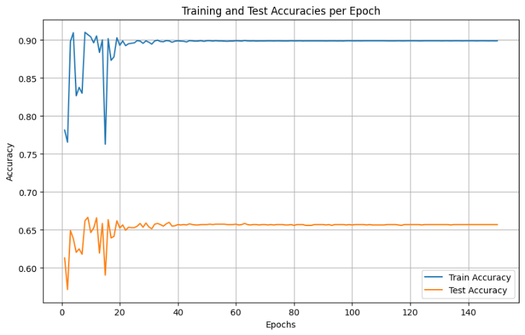

> Γιάννης Καραβέλλας 4228
>
> [2 Η ΥΠΟΧΡΕΩΤΙΚΗ ΕΡΓΑΣΙΑ ΣΤΟ ΜΑΘΗΜΑ]{.underline}
>
> [«ΝΕΥΡΩΝΙΚΑ ΔΙΚΤΥΑ -- ΒΑΘΙΑ ΜΑΘΗΣΗ»]{.underline}
>
> Η παρούσα εργασία ασχολείται με την υλοποίηση ενός **Support Vector
> Machine** σε python, με στόχο

τον διαχωρισμό 2 κλάσεων των εικόνων του dataset CIFAR-10. Συγκεκριμένα,
το μοντέλο θα εκπαιδευτεί

> για τον διαχωρισμό τον κλάσεων "cat" και "dog"
>
> Η υλοποίηση του SVM γίνετε χωρίς την χρήση εξωτερικών βιβλιοθηκών
> εκτός από NumPy και CuPy για
>
> gpu acceleration. Ακολουθούν τα βήματα υλοποίησης.
>
> Binary Classification with Linear Kernel
>
> 1)Κάνω load to CIFAR-10 dataset με την βοήθεια του
> **tensorflow.keras.datasets**
>
> 2)Επιλέγω ποιες 2 από τις 10 κλάσεις θέλω να διαχωρίσω, απαλείφοντας
> τις άλλες 8.
>
> 3)Ορίζω τις τιμές των labels για την πρώτη κλάση(dog) σαν **+1** και
> για την δεύτερη(cat) **-1.**
>
> 4)Κάνω flatten τις φωτογραφίες από 3D σε 1D και κανονικοποιώ από
> \[0,255\] σε \[0,1\].
>
> 5)Ακολουθεί η υλοποίηση των συναρτήσεων του SVM
>
> **def compute_loss (w, X, y, reg_lambda)**:
>
> Επέλεξα **Hinge loss** για loss function με **L2** regularization.
>
> 1 𝑛\
> 1) 𝐻𝑖𝑛𝑔𝑒𝑙𝑜𝑠𝑠=𝑛∑𝑖=1 max (0,1 −𝑦𝑖𝑓(𝑥)) , όπου 𝑦𝑖 η πραγματική τιμή, 𝑓(𝑥)
> η εκτίμηση του μοντέλου
>
> που περιγράφετε σαν 𝑓(𝑥) = 𝑤𝑇𝑥𝑖
>
> 2\) 𝐿2𝑙𝑜𝑠𝑠= 𝜆 2\|\|𝑤\|\|2 ή 𝜆 2∑ 𝑑 𝑗=1𝑤𝑗 2 ,
>
> Με **total loss** το άθροισμά τους

+-----------------------------------------------------------------------+
| > defcompute_loss(w, X, y, reg_lambda):                               |
+=======================================================================+
+-----------------------------------------------------------------------+

+-----------------------------------------------------------------------+
| > n_samples=X.shape\[0\]                                              |
+=======================================================================+
+-----------------------------------------------------------------------+

+-----------------------------------------------------------------------+
| > distances=cp.zeros(n_samples) \# Αρχικοποίηση                       |
+=======================================================================+
+-----------------------------------------------------------------------+

+-----------------------------------------------------------------------+
| > foriinrange(n_samples):                                             |
+=======================================================================+
+-----------------------------------------------------------------------+

+-----------------------------------------------------------------------+
| > dot_product=cp.dot(w.T, X\[i\]) \# Υπολογισμός w\^T \* x_i          |
+=======================================================================+
+-----------------------------------------------------------------------+

+-----------------------------------------------------------------------+
| > distances\[i\] =1-y\[i\] \*dot_product                              |
+=======================================================================+
+-----------------------------------------------------------------------+

+-----------------------------------------------------------------------+
| > distances=cp.maximum(0, distances) \# max(0, distance)              |
+=======================================================================+
+-----------------------------------------------------------------------+

+-----------------------------------------------------------------------+
| > hinge_loss=cp.mean(distances) \# Μέσος όρος των αποστάσεων (hinge   |
| > loss)                                                               |
+=======================================================================+
+-----------------------------------------------------------------------+

+-----------------------------------------------------------------------+
| > reg_loss=0.5\*reg_lambda\*cp.sum(w\*\*2)                            |
+=======================================================================+
+-----------------------------------------------------------------------+

+-----------------------------------------------------------------------+
| > \# Συνολική απώλεια                                                 |
+=======================================================================+
+-----------------------------------------------------------------------+

+-----------------------------------------------------------------------+
| > total_loss=hinge_loss+reg_loss                                      |
+=======================================================================+
+-----------------------------------------------------------------------+

> returntotal_loss
>
> Γιάννης Καραβέλλας 4228
>
> Επεξήγηση κώδικα:
>
> Με βάση τους ορισμούς που οριστήκαν πριν, για κάθε δείγμα𝒊,
> υπολογίζεται το 𝒘𝑻𝒙𝒊, δηλαδή το
>
> εσωτερικό γινόμενο των βαρών 𝒘 και του διανύσματος χαρακτηριστικών 𝒙𝒊.
> Υπολογίζω την απόσταση ως 𝟏−𝒚𝒊∙(𝒘𝑻𝒙𝒊), Αν το δείγμα ταξινομήθηκε
> σωστά, αυτή η τιμή είναι αρνητική ή μηδέν. Φιλτράρω

τις αποστάσεις ώστε να κρατάω μόνο τις θετικές (λάθος ταξινομημένα),
αυτό διασφαλίζει ότι τα σωστά

> ταξινομημένα δείγματα δεν συνεισφέρουν στην απώλεια. Βρίσκω τον μέσο
> όρο των φιλτραρισμένων
>
> αποστάσεων ορίζοντας το **hinge_loss**. Έπειτα υπολογίζω το L2
> **reg_loss** όπως έχει οριστεί,
>
> προσθέτοντας το **hinge_loss** και το **reg_loss**, επιστρέφω την
> συνολική απώλεια.
>
> **def compute_gradient (w, X, y, reg_lambda)**:
>
> Σύμφωνα με το η παράγωγος της hinge loss ως προς 𝒘𝒊 για 𝒙𝒊είναι:

+-----------------------------------+-----------------------------------+
| 𝝏𝒍𝒉𝒊𝒏𝒈𝒆                           | > −𝒚∙𝒙𝒊, 𝟏−𝒚∙(𝒘𝑻𝒙𝒊) \> 𝟎          |
+===================================+===================================+
| 𝝏𝒘𝒊                               | +---------+---------+---------+   |
|                                   | | = {     | > 𝟎,    | > 𝒙𝒊≥𝟎  |   |
|                                   | +=========+=========+=========+   |
|                                   | +---------+---------+---------+   |
+-----------------------------------+-----------------------------------+

> Γνωρίζοντας επίσης πως η παράγωγος του 𝐿2𝑙𝑜𝑠𝑠 εύκολα υπολογίζεται σε:

+-----------------------------------+-----------------------------------+
| 𝝏(𝟏𝟐𝝀𝒘𝒋𝟐)                         | > = 𝝀𝒘                            |
+===================================+===================================+
| 𝝏𝒘𝒊                               | > 𝒋                               |
+-----------------------------------+-----------------------------------+

+-----------------------------------------------------------------------+
| > defcompute_gradient(w, X, y, reg_lambda):                           |
+=======================================================================+
+-----------------------------------------------------------------------+

+-----------------------------------------------------------------------+
| > n_samples, n_features=X.shape                                       |
+=======================================================================+
+-----------------------------------------------------------------------+

+-----------------------------------------------------------------------+
| > grad_hinge=cp.zeros(n_features) \# Αρχικοποίηση                     |
+=======================================================================+
+-----------------------------------------------------------------------+

+-----------------------------------------------------------------------+
| > foriinrange(n_samples):                                             |
+=======================================================================+
+-----------------------------------------------------------------------+

+-----------------------------------------------------------------------+
| > dot_product=cp.dot(w.T, X\[i\])                                     |
+=======================================================================+
+-----------------------------------------------------------------------+

+-----------------------------------------------------------------------+
| > distance=1-y\[i\] \*dot_product                                     |
+=======================================================================+
+-----------------------------------------------------------------------+

+-----------------------------------------------------------------------+
| > ifdistance\>0:                                                      |
+=======================================================================+
+-----------------------------------------------------------------------+

+-----------------------------------------------------------------------+
| > grad_hinge+=-y\[i\] \*X\[i\]                                        |
+=======================================================================+
+-----------------------------------------------------------------------+

+-----------------------------------------------------------------------+
| > \# Υπολογισμός του μέσου όρου του gradient hinge loss               |
+=======================================================================+
+-----------------------------------------------------------------------+

+-----------------------------------------------------------------------+
| > grad_hinge/=n_samples                                               |
+=======================================================================+
+-----------------------------------------------------------------------+

+-----------------------------------------------------------------------+
| > \# Υπολογισμός του regularization gradient                          |
+=======================================================================+
+-----------------------------------------------------------------------+

+-----------------------------------------------------------------------+
| > grad_reg=reg_lambda\*w                                              |
+=======================================================================+
+-----------------------------------------------------------------------+

+-----------------------------------------------------------------------+
| > \# Συνολικό gradient                                                |
+=======================================================================+
+-----------------------------------------------------------------------+

+-----------------------------------------------------------------------+
| > grad_w=grad_reg+grad_hinge                                          |
+=======================================================================+
+-----------------------------------------------------------------------+

+-----------------------------------------------------------------------+
| > returngrad_w                                                        |
+=======================================================================+
+-----------------------------------------------------------------------+

> Επεξήγηση κώδικα:
>
> Όμοιος με πριν, υπολογίζω το 𝟏−𝒚𝒊∙(𝒘𝑻𝒙𝒊), ελέγχοντας αν είναι
> μεγαλύτερο του 0, αν είναι
>
> προσθέτω −𝒚∙𝒙𝒊στο **grad_hindge**. Υπολογίζω τον μέσο όρο του των
> παραγώγων και τον προσθέτω
>
> στην παράγωγο της κανονικοποίησης. Έτσι επιστρέφω το συνολικό gradient
> .
>
> Γιάννης Καραβέλλας 4228
>
> **def train_svm(X, y, learning_rate, reg_lambda, num_epochs)**:

+-----------------------------------------------------------------------+
| > deftrain_svm(X, y, learning_rate, reg_lambda, num_epochs):          |
+=======================================================================+
+-----------------------------------------------------------------------+

+-----------------------------------------------------------------------+
| > n_samples, n_features=X.shape                                       |
+=======================================================================+
+-----------------------------------------------------------------------+

+-----------------------------------------------------------------------+
| > w=cp.zeros(n_features)                                              |
+=======================================================================+
+-----------------------------------------------------------------------+

+-----------------------------------------------------------------------+
| > pbar=tqdm(range(1, num_epochs+1), desc=\'Training Progress\')       |
+=======================================================================+
+-----------------------------------------------------------------------+

+-----------------------------------------------------------------------+
| > forepochinpbar:                                                     |
+=======================================================================+
+-----------------------------------------------------------------------+

+-----------------------------------------------------------------------+
| > grad_w=compute_gradient(w, X, y, reg_lambda)                        |
+=======================================================================+
+-----------------------------------------------------------------------+

+-----------------------------------------------------------------------+
| > w-=learning_rate\*grad_w                                            |
+=======================================================================+
+-----------------------------------------------------------------------+

+-----------------------------------------------------------------------+
| > loss=compute_loss(w, X, y, reg_lambda)                              |
+=======================================================================+
+-----------------------------------------------------------------------+

+-----------------------------------------------------------------------+
| > pbar.set_description(f\'Epoch {epoch}, Loss: {loss:.4f}\')          |
+=======================================================================+
+-----------------------------------------------------------------------+

+-----------------------------------------------------------------------+
| > returnw                                                             |
+=======================================================================+
+-----------------------------------------------------------------------+

> Επεξήγηση κώδικα:

Αρχικά, αρχικοποιώ τα βάρη με 0 και με την βοήθεια της βιβλιοθήκης
**tqdm** για την παρακολούθηση της

> προόδου, μπαίνω στην λούπα εκπαίδευσης για συγκεκριμένες εποχές.
> Υπολογίζεται το gradient της
>
> συνάρτησης απώλειας (Hinge Loss + regularization) καλώντας τη
> **compute_gradient**. Ενημερώνω τα
>
> βάρη σύμφωνα με gradient descend. Υπολογίζω το loss και το εμφανίζω
> για κάθε εποχη. Τέλος
>
> επιστρέφω τα τελικά βάρη.
>
> **def predict(X, w):**

+-----------------------------------------------------------------------+
| > defpredict(X, w):                                                   |
+=======================================================================+
+-----------------------------------------------------------------------+

+-----------------------------------------------------------------------+
| > n_samples=X.shape\[0\]                                              |
+=======================================================================+
+-----------------------------------------------------------------------+

+-----------------------------------------------------------------------+
| > predictions=cp.zeros(n_samples)                                     |
+=======================================================================+
+-----------------------------------------------------------------------+

+-----------------------------------------------------------------------+
| > foriinrange(n_samples):                                             |
+=======================================================================+
+-----------------------------------------------------------------------+

+-----------------------------------------------------------------------+
| > dot_product=cp.dot(w.T, X\[i\])                                     |
+=======================================================================+
+-----------------------------------------------------------------------+

+-----------------------------------------------------------------------+
| > predictions\[i\] =cp.sign(dot_product)                              |
+=======================================================================+
+-----------------------------------------------------------------------+

+-----------------------------------------------------------------------+
| > returnpredictions                                                   |
+=======================================================================+
+-----------------------------------------------------------------------+

> Επεξήγηση κώδικα:
>
> Υπολογίζω το 𝒘𝑻𝒙𝒊 για κάθε δείγμα 𝒙𝒊 ξεχωριστά, αν το 𝒘𝑻𝒙𝒊\< 𝟎, τότε η
> πρόβλεψη είναι -1 και +1 για 𝒘𝑻𝒙𝒊\> 𝟎. Επιστρέφω τον πίνακα
> **predictions** που έχει τις προβλέψεις για κάθε δείγμα.
>
> **ΑΠΟΤΕΛΕΣΜΑΤΑ:**
> {width="0.508332239720035in"
> height="0.16111111111111112in"}
>
> Το μοντέλο εκπαιδευτικέ για ταξινόμηση των κλάσεων "cat" και "dog"
>
> Υπερπαραμέτροι:
>
> • learning_rate = 0.01\
> • reg_lambda = 0.001\
> • num_epochs = 100
>
> Test Accuracy: 58.55%
>
> Training Accuracy: 59.06%
>
> Γιάννης Καραβέλλας 4228

{width="6.5in"
height="4.158332239720035in"}

> Test Set Classification Report:
>
> precision recall f1-score support
>
> Class -1 0.59 0.55 0.57 1000
>
> Class 1 0.58 0.62 0.60 1000
>
> accuracy 0.59 2000
>
> macro avg 0.59 0.59 0.59 2000
>
> weighted avg 0.59 0.59 0.59 2000
>
> **ΒΕΛΙΣΤΟΠΟΙΗΣΕΙΣ**
>
> Η εκπαίδευση με for-loops αυξάνει σημαντικά την πολυπλοκότητα,
> ακολουθεί υλοποίηση με
>
> παραλληλισμό:

+-----------------------------------------------------------------------+
| > defcompute_loss(w, X, y, reg_lambda):                               |
+=======================================================================+
+-----------------------------------------------------------------------+

+-----------------------------------------------------------------------+
| > dot_products=cp.dot(X, w)                                           |
+=======================================================================+
+-----------------------------------------------------------------------+

+-----------------------------------------------------------------------+
| > distances=1-y\*dot_products                                         |
+=======================================================================+
+-----------------------------------------------------------------------+

+-----------------------------------------------------------------------+
| > distances=cp.maximum(0, distances)                                  |
+=======================================================================+
+-----------------------------------------------------------------------+

+-----------------------------------------------------------------------+
| > hinge_loss=cp.mean(distances)                                       |
+=======================================================================+
+-----------------------------------------------------------------------+

+-----------------------------------------------------------------------+
| > reg_loss=0.5\*reg_lambda\*cp.sum(w\*\*2)                            |
+=======================================================================+
+-----------------------------------------------------------------------+

+-----------------------------------------------------------------------+
| > total_loss=hinge_loss+reg_loss                                      |
+=======================================================================+
+-----------------------------------------------------------------------+

+-----------------------------------------------------------------------+
| > returntotal_loss                                                    |
+=======================================================================+
+-----------------------------------------------------------------------+

{width="0.44166666666666665in"
height="0.14029418197725285in"}{width="0.3680555555555556in"
height="0.1448086176727909in"}

> Γιάννης Καραβέλλας 4228

Έτσι, Όλες οι αποστάσεις 𝟏−𝒚𝒊∙(𝒘𝑻𝒙𝒊), υπολογίζονται ταυτόχρονα μέσω του
cp.dot(X, w),χωρίς

> τη χρήση βρόχου. Η πράξη y \* dot_productsεκτελείται διανυσματικά για
> όλα τα δείγματα και όχι
>
> ξεχωριστά για κάθε δείγμα.

+-----------------------------------------------------------------------+
| > defcompute_gradient(w, X, y, reg_lambda):                           |
+=======================================================================+
+-----------------------------------------------------------------------+

+-----------------------------------------------------------------------+
| > n_samples=X.shape\[0\]                                              |
+=======================================================================+
+-----------------------------------------------------------------------+

+-----------------------------------------------------------------------+
| > dot_products=cp.dot(X, w)                                           |
+=======================================================================+
+-----------------------------------------------------------------------+

+-----------------------------------------------------------------------+
| > distances=1-y\*dot_products                                         |
+=======================================================================+
+-----------------------------------------------------------------------+

+-----------------------------------------------------------------------+
| > misclassified=distances\>0                                          |
+=======================================================================+
+-----------------------------------------------------------------------+

+-----------------------------------------------------------------------+
| > grad_hinge=-cp.dot((misclassified\*y).T, X) /n_samples              |
+=======================================================================+
+-----------------------------------------------------------------------+

+-----------------------------------------------------------------------+
| > grad_reg=reg_lambda\*w                                              |
+=======================================================================+
+-----------------------------------------------------------------------+

+-----------------------------------------------------------------------+
| > grad_w=grad_reg+grad_hinge                                          |
+=======================================================================+
+-----------------------------------------------------------------------+

+-----------------------------------------------------------------------+
| > returngrad_w                                                        |
+=======================================================================+
+-----------------------------------------------------------------------+

> Όμοια με πριν υπολογίζει τις αποστάσεις 𝟏−𝒚𝒊∙(𝒘𝑻𝒙𝒊), δημιουργώ boolean
> array **misclassified** για το φιλτράρισμα των δειγμάτων. Το
> misclassified \* y, διαβεβεώνει πως τα δείγματα που παραβιάζουν το
>
> margin εχουν τιμή𝒚𝒊**,** ενώ τα άλλα **0.** Υπολογίζω το εσωτερικό
> γινόμενο των labels misclassified \* y με τον πίνακα **X,** αυτό είναι
> ισοδύναμο με την πρόσθεση −𝒚∙𝒙𝒊για κάθε δείγμα που έκανα στην
> προηγούμενη υλοποίηση. Η υπόλοιπη λογική είναι όμοια με πριν.
>
> Με αυτόν το τρόπο μείωσα τον χρόνο εκπαίδευσης από σε ! Χωρίς αλλαγή
> στα
>
> αποτελέσματα. Λόγο του ότι δουλεύω σε μόνο δύο κλάσεις του cifar-10,
> δεν χρειάστηκε υλοποίηση
>
> batches για θέματα μνήμης.
>
> Υλοποίηση LR scheduler

+-----------------------------------------------------------------------+
| > defup_then_down_scheduler(epoch, total_epochs, ramp_up_epochs,      |
| > min_lr, max_lr):                                                    |
+=======================================================================+
+-----------------------------------------------------------------------+

+-----------------------------------------------------------------------+
| > ifepoch\<=ramp_up_epochs:                                           |
+=======================================================================+
+-----------------------------------------------------------------------+

+-----------------------------------------------------------------------+
| > \# Linear ramp-up                                                   |
+=======================================================================+
+-----------------------------------------------------------------------+

+-----------------------------------------------------------------------+
| > lr=min_lr+ (max_lr-min_lr) \* (epoch/ramp_up_epochs)                |
+=======================================================================+
+-----------------------------------------------------------------------+

+-----------------------------------------------------------------------+
| > else:                                                               |
+=======================================================================+
+-----------------------------------------------------------------------+

+-----------------------------------------------------------------------+
| > \# Linear ramp-down                                                 |
+=======================================================================+
+-----------------------------------------------------------------------+

+-----------------------+-----------------------+-----------------------+
| > lr=max_lr-          |                       |                       |
| > (max_lr-min_lr) \*  |                       |                       |
| > ((                  |                       |                       |
| epoch-ramp_up_epochs) |                       |                       |
| > /                   |                       |                       |
| > (total_ep           |                       |                       |
| ochs-ramp_up_epochs)) |                       |                       |
| > returnlr            |                       |                       |
+=======================+=======================+=======================+
| •                     | > min_lr = 0.0001     | > {width=" |
|                       |                       | 3.7430555555555554in" |
|                       |                       | > height="            |
|                       |                       | 2.233332239720035in"} |
+-----------------------+-----------------------+-----------------------+
| •                     | > max_lr = 0.003      |                       |
+-----------------------+-----------------------+-----------------------+
| •                     | > ramp_up_epochs = 50 |                       |
+-----------------------+-----------------------+-----------------------+
| •                     | > total_epochs = 100  |                       |
+-----------------------+-----------------------+-----------------------+
| •                     | > reg_lambda = 0.001  |                       |
+-----------------------+-----------------------+-----------------------+
| •                     | > Training Accuracy:  |                       |
|                       | > 56.74%              |                       |
+-----------------------+-----------------------+-----------------------+
| •                     | > Test Accuracy:      |                       |
|                       | > 56.60%              |                       |
+-----------------------+-----------------------+-----------------------+

  -------------------------------------------------------------------------------------------------------------
  Γιάννης Καραβέλλας      {width="3.6666666666666665in"   4228
                          height="2.3472222222222223in"}                                
  ----------------------- ------------------------------------------------------------- -----------------------
  Training Accuracy:                                                                    
  56.74%                                                                                

  Test Accuracy: 56.60%                                                                 
  -------------------------------------------------------------------------------------------------------------

Προσθήκη bias & Standardization

Σύμφωνα με το το bias είναι σημαντικό στα SVMs, χωρίς αυτό o classifier
πάντα τέμνει την αρχή

τον αξόνων. Τρέχοντας την νέα υλοποίηση παίρνω ακριβός τα παρόμοια
αποτελέσματα. Αυτό σημαίνει

πως τα δεδομένα μου είναι σχεδόν κεντραρισμένα. Σύμφωνα με το ChatGPT
μπορώ να τυποποιήσω (

standardize) τα αρχικά δεδομένα, δηλαδή να εξασφαλίζω πως τα αρχικά
δεδομένα έχουν μέσο όρο 0 και

τυπική απόκλιση 1. Όντος τα αποτελέσματα βελτιώνονται.

Training Accuracy: 61.98%

Test Accuracy: 61.75%\
•

> •
>
> •
>
> •
>
> •\
> min_lr = 0.0001
>
> max_lr = 0.001
>
> ramp_up_epochs = 250
>
> total_epochs = 500
>
> reg_lambda = 0.0001

{width="0.5680555555555555in"
height="0.2013888888888889in"}{width="4.35138779527559in"
height="5.434721128608924in"}

> • min_lr = 0.0001
>
> • max_lr = 0.001
> {width="0.4708333333333333in"
> height="0.19027668416447943in"}
>
> • ramp_up_epochs = 50
>
> • total_epochs = 100
>
> • reg_lambda = 0.001

Training Accuracy: 60.18%

Test Accuracy: 60.05%

> Γιάννης Καραβέλλας 4228
>
> Προσθήκη Horizontal Flip
>
> Θα εκμεταλλευτώ την γρήγορη σύγκλιση του μοντέλου, και θα εφαρμόσω
> horizontal flip σε **όλα** τα
>
> αρχικά μου δεδομένα, κρατώντας τα original. Ως αποτέλεσμα το δεδομένα
> εκπαίδευσης να έχουν
>
> διπλασιαστεί σε πλήθος, δηλαδή έχω όλα τα original και όλα τα original
> flipped. Αυτό θα προσφέρει
>
> περισσότερα δεδομένα ώστε το μοντέλο μου να «μάθει» καλύτερα

+-----------------------------------------------------------------------+
| > \# Reshape back to image dimensions for augmentation                |
+=======================================================================+
+-----------------------------------------------------------------------+

+-----------------------------------------------------------------------+
| > x_train_rh=x_train.reshape(-1, 32, 32, 3)                           |
+=======================================================================+
+-----------------------------------------------------------------------+

+-----------------------------------------------------------------------+
| > x_train_flipped=x_train_rh\[:, :, ::-1, :\]                         |
+=======================================================================+
+-----------------------------------------------------------------------+

+-----------------------------------------------------------------------+
| > \# Combine original and flipped images                              |
+=======================================================================+
+-----------------------------------------------------------------------+

+-----------------------------------------------------------------------+
| > x_train_augmented=cp.vstack(\[x_train_rh, x_train_flipped\])        |
+=======================================================================+
+-----------------------------------------------------------------------+

+-----------------------------------------------------------------------+
| > \# Duplicate labels for flipped images                              |
+=======================================================================+
+-----------------------------------------------------------------------+

+-----------------------------------------------------------------------+
| > y_train_augmented=cp.hstack(\[y_train, y_train\])                   |
+=======================================================================+
+-----------------------------------------------------------------------+

+-----------------------------------------------------------------------+
| > \# Reshape augmented training data back to flattened format         |
+=======================================================================+
+-----------------------------------------------------------------------+

+-----------------------------------------------------------------------+
| > x_train=x_train_augmented.reshape(x_train_augmented.shape\[0\], -1) |
+=======================================================================+
+-----------------------------------------------------------------------+

+-----------------------------------------------------------------------+
| > y_train=y_train_augmented                                           |
+=======================================================================+
+-----------------------------------------------------------------------+

+-----------------------+-----------------------+-----------------------+
| > •\                  | min_lr = 0.0001       | > {width="0 |
| > •\                  |                       | .45416666666666666in" |
| > •\                  |                       | > height="            |
| > •                   |                       | 0.195832239720035in"} |
+=======================+=======================+=======================+
|                       | > ramp_up_epochs =    |                       |
|                       | > 100 total_epochs =  |                       |
|                       | > 200\                |                       |
|                       | > reg_lambda = 0.0001 |                       |
+-----------------------+-----------------------+-----------------------+

> Training Accuracy: 60.53%
>
> Test Accuracy: 60.55%
>
> {width="3.2583333333333333in"
> height="2.084721128608924in"}
>
> Για σκοπούς σύγκρισης τρέχω το μοντέλο μου για διαχωρισμό των κλάσεων
> «dog» και «airplane»

+-----------------------+-----------------------+-----------------------+
| > •\                  | min_lr = 0.0001       | > {width=" |
| > •\                  |                       | 0.6138888888888889in" |
| > •\                  |                       | > height="0.          |
| > •                   |                       | 18888888888888888in"} |
+=======================+=======================+=======================+
|                       | > ramp_up_epochs =    |                       |
|                       | > 100 total_epochs =  |                       |
|                       | > 200\                |                       |
|                       | > reg_lambda = 0.0001 |                       |
+-----------------------+-----------------------+-----------------------+

> Training Accuracy: 84.06%
>
> Test Accuracy: 83.90%
>
> {width="3.6305555555555555in"
> height="2.348611111111111in"}
>
> Λογικά αποτελέσματα, εφόσον οι κλάσεις «dog» και «cat» έχουν όμοια
> χαρακτηριστικά.
>
> Γιάννης Καραβέλλας 4228
>
> Προσθήκη Random Crop\
> Όμοια με την **Horizontal Flip** δημιουργώ ένα ακόμη copy του original
> dataset και εφαρμόζω crop
>
> defrandom_crop_with_padding(images, crop_size=(32, 32), padding=4):\
> images=cp.asarray(images)\
> \# Get image dimensions\
> size, height, width, channels=images.shape\
> \# Create a padded image array\
> padded_height=height+2\*padding\
> padded_width=width+2\*padding\
> padded_images=cp.zeros((size, padded_height, padded_width, channels),
> dtype=images.dtype) \# Copy original images into the center of the
> padded images\
> padded_images\[:, padding:padding+height, padding:padding+width, :\]
> =images\
> \# Initialize an array to store cropped images\
> cropped_images=cp.empty((size, \*crop_size, channels),
> dtype=images.dtype)\
> \# Randomly crop each image\
> foriinrange(size):\
> h_start=np.random.randint(0, 2\*padding+1)\
> w_start=np.random.randint(0, 2\*padding+1)\
> cropped_images\[i\] =padded_images\[i, h_start:h_start+crop_size\[0\],
> w_start:w_start+crop_size\[1\],

+-----------------------------------------------------------------------+
| > :\]                                                                 |
+=======================================================================+
+-----------------------------------------------------------------------+

+-----------------------------------------------------------------------+
| > returncropped_images                                                |
+=======================================================================+
+-----------------------------------------------------------------------+

> Παίρνω το πλήθος εικόνων **size** το **height**, **width** και τα
> **channels**. Υπολογίζω τις νέες διαστάσεις με το padding πάνω, κάτω,
> δεξια και αριστερά, και γεμίζω τον πίνακα με μηδενικά. Τοποθετώ τις
> original εικόνες στο κέντρο του padded πίνακα μου, έχοντας padding
> γύρω τους. Αρχικοποιώ τον\
> **cropped_immages** με τις σωστές διαστάσεις. Μετά για κάθε εικόνα
> επιλέγονται τυχαίες αρχικές θέσεις **h_start** για ύψος και
> **w_start** για πλάτος, με περιορισμούς ώστε να διασφαλίσουμε ότι το
> crop δεν θα υπερβεί το ύψος της padded εικόνας. Aπό τη padded εικόνα
> γίνεται αποκοπή **cropped_images**ξεκινώντας από τις θέσεις
> **h_start** και **w_start** και με διαστάσεις που ορίζονται από το
> **crop_size**.
>
> Επιστρέφω τις cropped εικόνες.

+-----------------------+-----------------------+-----------------------+
| > •\                  | min_lr = 0.0001       | > {width=" |
| > •\                  |                       | 0.5333333333333333in" |
| > •\                  |                       | > height="0.          |
| > •                   |                       | 18472222222222223in"} |
+=======================+=======================+=======================+
|                       | > ramp_up_epochs =    |                       |
|                       | > 100 total_epochs =  |                       |
|                       | > 200\                |                       |
|                       | > reg_lambda = 0.0001 |                       |
+-----------------------+-----------------------+-----------------------+

> Training Accuracy: 59.52%
>
> Test Accuracy: 60.45%
>
> {width="2.8833333333333333in"
> height="1.8444433508311462in"}
>
> Γιάννης Καραβέλλας 4228
>
> Hyperparameter Tuning
>
> Τρέχω το μοντέλο για διαφορετικά **min_lr** & **max_lr**, για
> διαφορετικό αριθμό εποχών
>
> Αποτελέσματα:

+-----------------------+-----------------------+-----------------------+
| {width=" | /image16.png){width=" | /image17.png){width=" |
| 2.5444444444444443in" | 2.5402766841644793in" | 2.6319444444444446in" |
| height="1             | > height="1.6875in"}  | > height="1           |
| .6888888888888889in"} |                       | .7472222222222222in"} |
+=======================+=======================+=======================+
+-----------------------+-----------------------+-----------------------+

> Βρίσκω πως οι καλύτερες Υπερπαραμέτροι είναι:
>
> • min_lr = 0.0005
>
> • max_lr = 0.01
>
> • ramp_up_epochs = 50
>
> • total_epochs = 100
>
> • reg_lambda = 0.001
>
> Τρέχοντας το μοντέλο με αποκλειστικά αυτές τις παραμέτρους :
>
> Training Accuracy: 61.10% Test Accuracy: 62.45%
>
> {width="2.3680555555555554in"
> height="1.5152766841644794in"}
>
> Θα ξανατρέξω το script του hyper parameter tuning αυτή την φορά χωρίς
> data augmentation/preprocessing, αφήνοντας μόνο το standardization

+-----------------------+-----------------------+-----------------------+
| > {width=" | /image20.png){width=" | /image21.png){width=" |
| 2.5055555555555555in" | 2.6930555555555555in" | 2.6930555555555555in" |
| > height="1           | height="1             | height="1.7875in"}    |
| .6819444444444445in"} | .7861111111111112in"} |                       |
+=======================+=======================+=======================+
+-----------------------+-----------------------+-----------------------+

> Γιάννης Καραβέλλας 4228

Βέλτιστες υπερπαραμέτροι:

> • min_lr = 0.0005
> {width="0.4597211286089239in"
> height="0.1472211286089239in"}
>
> • max_lr = 0.01
>
> • ramp_up_epochs = 100
>
> • total_epochs = 200
>
> • reg_lambda = 0.001

Training Accuracy: 63.69%

Test Accuracy: 63.40%

> {width="3.0in"
> height="1.9013888888888888in"}
>
> Καταλήγω πως το μοντέλο αποδίδει καλύτερα αλλά και γρηγορότερα, όταν
> εφαρμόζω **μόνο** standardization στην είσοδο.
>
> Binary Classification with Polynomial Kernel
>
> Θα υλοποιήσω Dual Form SVM και σύμφωνα με
>
> {width="3.7041666666666666in"
> height="1.183332239720035in"}
>
> «where zeta is the distance of a misclassified point from its correct
> hyperplane»
>
> «If the value of C is very high then we try to minimize the number of
> misclassified points drastically which results in overfitting, and
> with decrease in value of C there will be underfitting»

{width="3.8361111111111112in"
height="1.4875in"}

> Συνάρτηση απόφασης
>
> 𝑛
>
> 𝑓(𝑥) = ∑𝛼𝑗𝑦𝑗𝐾(𝑥𝑗, 𝑥) + 𝑏\
> 𝑗=1
>
> Γιάννης Καραβέλλας 4228
>
> Με βάση το η ενημέρωση του𝜶𝒋στην εκπαίδευση βασίζετε εδώ:

+-----------------------+-----------------------+-----------------------+
| 𝜕𝑤                    | 𝑛                     |                       |
+=======================+=======================+=======================+
|                       |                       |                       |
+-----------------------+-----------------------+-----------------------+
| 𝜕𝑎𝑖                   | = 1 −𝑦𝑖∑𝑎𝑗𝑦𝑗𝐾(𝑥𝑖, 𝑥𝑗) | > = 1 −𝑦𝑖𝑓(𝑥𝑖)        |
+-----------------------+-----------------------+-----------------------+
|                       | 𝑗−1                   |                       |
+-----------------------+-----------------------+-----------------------+

> Για την ενημέρωση του 𝒃 **,** εύκολα βρίσκω ξεκινώντας από

+-----------------------------------+-----------------------------------+
| > 𝑚𝑦𝑖𝑓(𝑥𝑖) = 1, καταλήγω σε 𝑏𝑖=   | > 𝑎𝑗𝑦𝑗𝐾(𝑥𝑗,𝑥𝑖)                    |
| > 𝑦𝑖−∑𝑗=1                         |                                   |
+===================================+===================================+
+-----------------------------------+-----------------------------------+

> Ορίζοντας το τελικό 𝒃**,** ως τον μέσο όρο των 𝒃𝒊.

+-----------------------------------------------------------------------+
| > defpolynomial_kernel(X, Y, degree=3, coef0=1):                      |
+=======================================================================+
+-----------------------------------------------------------------------+

+-----------------------------------------------------------------------+
| > return (cp.dot(X, Y.T) +coef0) \*\*degree                           |
+=======================================================================+
+-----------------------------------------------------------------------+

> Υλοποιεί τον ορισμό 𝐾(𝑋, 𝑌) = (𝑋∙𝑌𝑇+ 𝑐)𝑑

+-----------------------------------------------------------------------+
| > classPolySVM:                                                       |
+=======================================================================+
+-----------------------------------------------------------------------+

> Ορίζω κλαση

+-----------------------------------------------------------------------+
| > ef\_\_init\_\_(self, C=1.0, epochs=100, degree=3, coef0=1):         |
+=======================================================================+
+-----------------------------------------------------------------------+

+-----------------------------------------------------------------------+
| > self.kernel=polynomial_kernel                                       |
+=======================================================================+
+-----------------------------------------------------------------------+

+-----------------------------------------------------------------------+
| > self.C=C                                                            |
+=======================================================================+
+-----------------------------------------------------------------------+

+-----------------------------------------------------------------------+
| > self.epochs=epochs                                                  |
+=======================================================================+
+-----------------------------------------------------------------------+

+-----------------------------------------------------------------------+
| > self.degree=degree                                                  |
+=======================================================================+
+-----------------------------------------------------------------------+

+-----------------------------------------------------------------------+
| > self.coef0=coef0                                                    |
+=======================================================================+
+-----------------------------------------------------------------------+

+-----------------------------------------------------------------------+
| > self.alphas=None                                                    |
+=======================================================================+
+-----------------------------------------------------------------------+

+-----------------------------------------------------------------------+
| > self.b=0                                                            |
+=======================================================================+
+-----------------------------------------------------------------------+

+-----------------------------------------------------------------------+
| > self.K=None                                                         |
+=======================================================================+
+-----------------------------------------------------------------------+

+-----------------------------------------------------------------------+
| > self.X=None                                                         |
+=======================================================================+
+-----------------------------------------------------------------------+

+-----------------------------------------------------------------------+
| > self.y=None                                                         |
+=======================================================================+
+-----------------------------------------------------------------------+

+-----------------------------------------------------------------------+
| > self.support_vectors=None                                           |
+=======================================================================+
+-----------------------------------------------------------------------+

+-----------------------------------------------------------------------+
| > self.support_alphas=None                                            |
+=======================================================================+
+-----------------------------------------------------------------------+

+-----------------------------------+-----------------------------------+
| > •\                              | > self.support_y=None             |
| > •\                              | >                                 |
| > •\                              | > Αρχικοποιώ τον πυρήνα με βάση   |
| > •\                              | > def polynomial_kernel που       |
| > •\                              | > ορίστηκε πριν.                  |
| > •                               | >                                 |
|                                   | > Αρχικοποιώ το **C**, που έχει   |
|                                   | > οριστεί πάνω.                   |
|                                   | >                                 |
|                                   | > **self.K,** αποθηκεύει τον      |
|                                   | > πίνακα kernel, ουσιαστικά 𝑲\[𝒊, |
|                                   | > 𝒋\] = 𝑲(𝒙𝒊, 𝒙𝒋)\                |
|                                   | > **self.support_vectors,** τα    |
|                                   | > δεδομένα εισόδου 𝒙𝒊 για τα      |
|                                   | > οποία 𝒂𝒊\> 𝟎 μετά την           |
|                                   | > εκπαίδευση.                     |
|                                   | > **self.support_alphas,**        |
|                                   | > Αποθηκεύει τις παραμέτρους 𝒂𝒊   |
|                                   | > που αντιστοιχούν στα support    |
|                                   | > vectors. **self.support_y**,    |
|                                   | > Αποθηκεύει τις ετικέτες 𝒚𝒊 που  |
|                                   | > αντιστοιχούν στα support        |
|                                   | > vectors.                        |
+===================================+===================================+
+-----------------------------------+-----------------------------------+

+-----------------------------------------------------------------------+
| > deffit(self, X, y):                                                 |
+=======================================================================+
+-----------------------------------------------------------------------+

+-----------------------------------------------------------------------+
| > self.X=X                                                            |
+=======================================================================+
+-----------------------------------------------------------------------+

+-----------------------------------------------------------------------+
| > self.y=y                                                            |
+=======================================================================+
+-----------------------------------------------------------------------+

> Γιάννης Καραβέλλας 4228
>
> m, n=X.shape\
> self.alphas=cp.zeros(m)\
> self.b=0\
> self.K=self.kernel(X, X, degree=self.degree, coef0=self.coef0)
>
> forepochintqdm(range(self.epochs), desc=\'Training Epochs\'):
> foriinrange(m):\
> \# Compute the decision function for xi\
> f_i=cp.sum(self.alphas\*self.y\*self.K\[:, i\]) +self.b
> E_i=f_i-self.y\[i\]
>
> \# Compute gradient w.r.t alpha_i\
> gradient=1-self.y\[i\] \*f_i
>
> \# Update rule\
> if (self.y\[i\] \*f_i\<1):\
> \# Gradient for alpha_i\
> grad_alpha_i=gradient# Since dual objective is to maximize \# Update
> alpha_i\
> self.alphas\[i\] +=self.lr\*grad_alpha_i\
> \# Clip alpha_i to \[0, C\]\
> self.alphas\[i\] =cp.clip(self.alphas\[i\], 0, self.C)\
> else:\
> \# If no update needed\
> continue
>
> \# Update bias term b\
> \# Identify support vectors (0 \< alpha_i \< C)\
> support_vector_indices=cp.where((self.alphas\>1e-5) &
> (self.alphas\<self.C))\[0\] iflen(support_vector_indices) \>0:\
> \# Compute the sum over all alpha_j \* y_j \* K(x_j, x_i) for each
> support vector i \# Reshape alphas \* y for broadcasting\
> sum_alpha_y_K=cp.sum((self.alphas\*self.y)\[:, cp.newaxis\]
> \*self.K\[:, support_vector_indices\], axis=0)
>
> \# Compute b as the mean of (y_i - sum_alpha_y_K) over support vectors
> self.b=cp.mean(y\[support_vector_indices\] -sum_alpha_y_K)\
> else:\
> self.b=0
>
> \# Extract support vectors after training\
> self.support_vector_indices=cp.where(self.alphas\>1e-5)\[0\]
> self.support_vectors=self.X\[self.support_vector_indices\]
> self.support_alphas=self.alphas\[self.support_vector_indices\]
> self.support_y=self.y\[self.support_vector_indices\]
>
> Γιάννης Καραβέλλας 4228
>
> 1.Υπολογίζω τον **self.K** μία φορά στην αρχή για την χρήση του στον
> βρόχο\
> 2.Αρχικοποιώ τα 𝜶𝒊και το 𝒃με μηδενικά\
> 3.Μπαίνω σε loop για όλα τα δείγματα 𝒙𝒊για κάθε εποχη\
> a.Υπολογίζω το 𝒇(𝒙𝒊) = ∑𝒏 𝒋=𝟏𝜶𝒋𝒚𝒋𝑲(𝒙𝒋, 𝒙𝒊) + 𝒃\
> b.Υπολογίζω το 𝟏−𝒚𝒊𝒇(𝒙𝒊)και ελέγχω αν είναι \< 1\
> c.Αν είναι \< 1\
> i.Ενημερώνω το 𝜶𝒋με βάση την τιμή του 𝟏−𝒚𝒊𝒇(𝒙𝒊)\
> ii.και το περιορίζω στο διάστημα \[0,C\]\
> d.Μετά την ενημέρωση όλων των 𝜶𝒋 σε μια εποχή γεμίζω το
> **support_vector_indices** e.Για αυτά τα διαστήματα ενημερώνω το 𝒃\
> 4.Γεμίζω όλα τα **support_vectors**

+-----------------------------------+-----------------------------------+
| > 5\. 6. 7.                       | > defdecision_function(self, X):\ |
|                                   | > K=self.kernel(X,                |
|                                   | > self.support_vectors,           |
|                                   | > degree=self.degree,             |
|                                   | > coef0=self.coef0)               |
|                                   | > returncp.dot(K,                 |
|                                   | > sel                             |
|                                   | f.support_alphas\*self.support_y) |
|                                   | > +self.b                         |
+===================================+===================================+
+-----------------------------------+-----------------------------------+

+-----------------------------------+-----------------------------------+
| > 8.\                             | > defpredict(self, X):            |
| > 9.                              |                                   |
+===================================+===================================+
+-----------------------------------+-----------------------------------+

+-----------------------------------------------------------------------+
| > 10.returncp.sign(self.decision_function(X))                         |
+=======================================================================+
+-----------------------------------------------------------------------+

> 1.Υπολογίζω το Kernel με βάση τα support_vectors δηλαδή 𝑲(𝒙𝒕𝒆𝒔𝒕,
> 𝒙𝒔𝒖𝒑𝒑𝒐𝒓𝒕)**.**
>
> 2.Με την βοήθεια των άλλων support vectors υπολογίζεται η συνάρτηση
> απόφασης. 𝑓(𝑥𝑡𝑒𝑠𝑡) = ∑𝑠 𝑖=1𝑎𝑖𝑦𝑖𝐾(𝑥𝑖, 𝑥𝑡𝑒𝑠𝑡) + 𝑏
>
> Παραδείγματα εκτέλεσης

+-----------------------+-----------------------+-----------------------+
| > •\                  | > C=3.0               | {width=" |
| > •\                  |                       | 0.7277777777777777in" |
| > •\                  |                       | height="0             |
| > •\                  |                       | .1736111111111111in"} |
| > •                   |                       |                       |
+=======================+=======================+=======================+
|                       | > tol=1e-3\           |                       |
|                       | > epochs=50\          |                       |
|                       | > learning_rate=0.001 |                       |
|                       | > degree=3\           |                       |
|                       | > coef0=1             |                       |
+-----------------------+-----------------------+-----------------------+

> Training Accuracy: 63.38% Test Accuracy: 62.60%
>
> {width="3.9680555555555554in"
> height="2.2805555555555554in"}

{width="8.333333333333333e-2in"
height="6.944444444444445e-2in"}{width="6.944444444444445e-2in"
height="4.1666666666666664e-2in"}{width="0.5138888888888888in"
height="0.125in"}{width="6.944444444444445e-2in"
height="8.333333333333333e-2in"}{width="9.722222222222222e-2in"
height="0.16666666666666666in"}{width="8.333333333333333e-2in"
height="5.555555555555555e-2in"}{width="9.722222222222222e-2in"
height="8.333333333333333e-2in"}{width="8.333333333333333e-2in"
height="0.125in"}{width="4.1666666666666664e-2in"
height="6.944444444444445e-2in"}{width="3.5569444444444445in"
height="2.2729965004374453in"}{width="4.1666666666666664e-2in"
height="4.1666666666666664e-2in"}{width="0.16666666666666666in"
height="4.1666666666666664e-2in"}{width="8.333333333333333e-2in"
height="6.944444444444445e-2in"}{width="6.944444444444445e-2in"
height="4.1666666666666664e-2in"}{width="0.16666666666666666in"
height="4.1666666666666664e-2in"}{width="0.16666666666666666in"
height="4.1666666666666664e-2in"}{width="9.722222222222222e-2in"
height="6.944444444444445e-2in"}{width="6.944444444444445e-2in"
height="4.1666666666666664e-2in"}{width="0.16666666666666666in"
height="4.1666666666666664e-2in"}{width="9.722222222222222e-2in"
height="6.944444444444445e-2in"}{width="3.5597222222222222in"
height="2.2747714348206474in"}{width="6.944444444444445e-2in"
height="4.1666666666666664e-2in"}{width="0.5277777777777778in"
height="0.18055555555555555in"}{width="4.1666666666666664e-2in"
height="8.333333333333333e-2in"}{width="5.555555555555555e-2in"
height="5.555555555555555e-2in"}{width="0.2638888888888889in"
height="0.1111111111111111in"}{width="8.333333333333333e-2in"
height="0.1111111111111111in"}{width="6.944444444444445e-2in"
height="0.125in"}{width="0.3611111111111111in"
height="0.16666666666666666in"}{width="0.1388888888888889in"
height="0.2222222222222222in"}{width="3.3833333333333333in"
height="2.167518591426072in"}{width="5.555555555555555e-2in"
height="4.1666666666666664e-2in"}{width="5.555555555555555e-2in"
height="4.1666666666666664e-2in"}{width="4.1666666666666664e-2in"
height="4.1666666666666664e-2in"}{width="4.1666666666666664e-2in"
height="6.944444444444445e-2in"}{width="9.722222222222222e-2in"
height="8.333333333333333e-2in"}{width="0.4305555555555556in"
height="9.722222222222222e-2in"}{width="0.125in"
height="9.722222222222222e-2in"}{width="6.944444444444445e-2in"
height="0.125in"}{width="9.722222222222222e-2in"
height="0.1111111111111111in"}{width="0.1527777777777778in"
height="0.2777777777777778in"}

> Γιάννης Καραβέλλας 4228
>
> • C=3.0,
>
> • tol=1e-3
>
> • epochs=50
>
> • learning_rate=0.001
>
> • degree=4
>
> • coef0=1
>
> Training Accuracy: 63.68%
>
> Test Accuracy: 62.55%

+-----------------------+-----------------------+-----------------------+
| •                     | C=1.0,                | > {width=" |
|                       |                       | 0.6861100174978128in" |
|                       |                       | > height="0           |
|                       |                       | .1847211286089239in"} |
+=======================+=======================+=======================+
+-----------------------+-----------------------+-----------------------+

> • tol=1e-3
>
> • epochs=50
>
> • learning_rate=0.01
>
> • degree=3
>
> • coef0=1
>
> Training Accuracy: 62.62%
>
> Test Accuracy: 62.85%

{width="6.75in"
height="1.3888888888888888e-2in"}

+-----------------------+-----------------------+-----------------------+
| > •\                  | C=0.01                | > {width=" |
| > •\                  |                       | 0.7430555555555556in" |
| > •\                  |                       | > height="0           |
| > •\                  |                       | .2152777777777778in"} |
| > •                   |                       |                       |
+=======================+=======================+=======================+
|                       | > tol=1e-3\           |                       |
|                       | > epochs=50\          |                       |
|                       | > learning_rate=0.01\ |                       |
|                       | > degree=3\           |                       |
|                       | > coef0=1             |                       |
+-----------------------+-----------------------+-----------------------+

> Training Accuracy: 63.63%
>
> Test Accuracy: 61.90%

{width="3.5180555555555557in"
height="2.249919072615923in"}{width="4.1666666666666664e-2in"
height="4.1666666666666664e-2in"}{width="5.555555555555555e-2in"
height="4.1666666666666664e-2in"}{width="4.1666666666666664e-2in"
height="4.1666666666666664e-2in"}{width="4.1666666666666664e-2in"
height="4.1666666666666664e-2in"}{width="4.1666666666666664e-2in"
height="4.1666666666666664e-2in"}{width="5.555555555555555e-2in"
height="4.1666666666666664e-2in"}{width="9.722222222222222e-2in"
height="8.333333333333333e-2in"}{width="0.1527777777777778in"
height="0.1527777777777778in"}{width="0.4444444444444444in"
height="0.16666666666666666in"}{width="3.426388888888889in"
height="4.102649825021873in"}{width="0.19444444444444445in"
height="0.20833333333333334in"}{width="0.2222222222222222in"
height="0.2361111111111111in"}{width="0.2222222222222222in"
height="0.2361111111111111in"}{width="9.722222222222222e-2in"
height="9.722222222222222e-2in"}{width="0.1527777777777778in"
height="0.1527777777777778in"}{width="0.1527777777777778in"
height="0.1527777777777778in"}{width="9.722222222222222e-2in"
height="0.1111111111111111in"}{width="4.1666666666666664e-2in"
height="4.1666666666666664e-2in"}{width="4.1666666666666664e-2in"
height="4.1666666666666664e-2in"}{width="4.1666666666666664e-2in"
height="4.1666666666666664e-2in"}{width="4.1666666666666664e-2in"
height="4.1666666666666664e-2in"}{width="8.333333333333333e-2in"
height="8.333333333333333e-2in"}{width="0.1527777777777778in"
height="0.1388888888888889in"}{width="0.4166666666666667in"
height="0.16666666666666666in"}

+-----------------+-----------------+-----------------+-----------------+
| > Γιάννης       |                 |                 | 4228            |
| > Καραβέλλας    |                 |                 |                 |
+=================+=================+=================+=================+
| •               | C=10            | >               |                 |
|                 |                 | {width="0.7388 |                 |
|                 |                 | 877952755906in" |                 |
|                 |                 | >               |                 |
|                 |                 | height="0.17638 |                 |
|                 |                 | 88888888889in"} |                 |
+-----------------+-----------------+-----------------+-----------------+
| •               | > tol=1e-3      |                 |                 |
+-----------------+-----------------+-----------------+-----------------+
| •               | > epochs=30     |                 |                 |
+-----------------+-----------------+-----------------+-----------------+
| •               | > lear          |                 |                 |
|                 | ning_rate=0.001 |                 |                 |
+-----------------+-----------------+-----------------+-----------------+
| •               | > degree=3      |                 |                 |
+-----------------+-----------------+-----------------+-----------------+
| •               | > coef0=1       |                 |                 |
+-----------------+-----------------+-----------------+-----------------+

> Training Accuracy: 63.39%
>
> Test Accuracy: 62.60%
>
> Προσθήκη Learning Rate Scheduler στο μοντέλο
>
> Ο scheduler είναι ο ίδιος που χρησιμοποιήθηκε στο Linear μοντέλο
>
> • C=10
>
> • tol=1e-3
>
> • epochs=30
>
> • degree=3
>
> • coef0=1
>
> • min_lr = 0.0005
>
> • max_lr = 0.01
>
> • ramp_up_epochs = 15
>
> Training Accuracy: 63.39%
>
> Test Accuracy: 62.60%

{width="6.75in"
height="1.3888888888888888e-2in"}

> Γιάννης Καραβέλλας 4228
>
> Προσθήκη Standardization στα αρχικά δεδομένα

+-----------------+-----------------+-----------------+-----------------+
| •               | C=10,           | >               | >               |
|                 |                 | {width="0.5263 | ){width="3.1805 |
|                 |                 | 888888888889in" | 555555555554in" |
|                 |                 | > h             | >               |
|                 |                 | eight="0.191665 |  height="2.0333 |
|                 |                 | 57305336832in"} | 33333333333in"} |
+=================+=================+=================+=================+
| •               | > epochs=30,    |                 |                 |
+-----------------+-----------------+-----------------+-----------------+
| •               | > degree=3,     |                 |                 |
+-----------------+-----------------+-----------------+-----------------+
| •               | > coef0=1       |                 |                 |
+-----------------+-----------------+-----------------+-----------------+
| •               | > min_lr =      |                 |                 |
|                 | > 0.0005        |                 |                 |
+-----------------+-----------------+-----------------+-----------------+
| •               | > max_lr = 0.01 |                 |                 |
+-----------------+-----------------+-----------------+-----------------+
| •               | >               |                 |                 |
|                 |  ramp_up_epochs |                 |                 |
|                 | > = 15          |                 |                 |
+-----------------+-----------------+-----------------+-----------------+

> Training Accuracy: 78.93%\
> Test Accuracy: 60.70%
>
> Hyperparameter Tuning
>
> Έτρεξα το μοντέλο για τις εξής τιμές:

+-----------------------------------+-----------------------------------+
| > •\                              | > C_values = \[1e-3, 1e-2, 1e-1,  |
| > •\                              | > 1, 10, 100\] degree_values =    |
| > •                               | > \[2, 3, 4, 5\]\                 |
|                                   | > coef0_values = \[0, 2.5, 5,     |
|                                   | > 7.5, 10\]                       |
+===================================+===================================+
+-----------------------------------+-----------------------------------+

> Έτρεξα όλους τους πιθανούς συνδυασμούς αυτών των υπερπαραμέτρων για 30
> εποχές και
>
> min_lr=0.0005, max_lr=0.001, ramp_up_epochs=15. Από τα 120 διαφορετικά
> μοντέλα τα top 5 είναι:
>
> **Top 5 Hyperparameter Combinations:**\
> **C Degree coef0 Test Accuracy Train Accuracy 0 10.000 2 7.5 0.6425
> 0.7349 1 0.001 2 5.0 0.6370 0.7380 2 100.000 2 7.5 0.6350 0.7060 3
> 0.100 2 2.5 0.6340 0.7426 4 1.000 2 5.0 0.6335 0.7371**
>
> **Best Hyperparameters:**\
> **C=10.0, Degree=2, coef0=7.5**

{width="1.0916666666666666in"
height="0.20833333333333334in"}

Γιάννης Καραβέλλας 4228

Τρέχοντας το καλύτερο ξεχωριστά επιβεβαιώνω πως:

+-----------------+-----------------+-----------------+-----------------+
| •               | C=10,           | >               | {width="2.9527 |
|                 |                 | ){width="0.6180 | 766841644794in" |
|                 |                 | 555555555556in" | height="1.88888 |
|                 |                 | > h             | 88888888888in"} |
|                 |                 | eight="0.158333 |                 |
|                 |                 | 33333333333in"} |                 |
+=================+=================+=================+=================+
| •               | > epochs=30,    |                 |                 |
+-----------------+-----------------+-----------------+-----------------+
| •               | > degree=2,     |                 |                 |
+-----------------+-----------------+-----------------+-----------------+
| •               | > coef0=7.5     |                 |                 |
+-----------------+-----------------+-----------------+-----------------+
| •               | > min_lr =      |                 |                 |
|                 | > 0.0005        |                 |                 |
+-----------------+-----------------+-----------------+-----------------+
| •               | > max_lr =      |                 |                 |
|                 | > 0.001         |                 |                 |
+-----------------+-----------------+-----------------+-----------------+
| •               | >               |                 |                 |
|                 |  ramp_up_epochs |                 |                 |
|                 | > = 15          |                 |                 |
+-----------------+-----------------+-----------------+-----------------+

**Training Accuracy: 73.49%**

**Test Accuracy: 64.25%**

> Γιάννης Καραβέλλας 4228
>
> SMO approach
>
> Binary Classification With RBF kernel Using SMO
>
> Αλλάζοντας το Kernel function σε RBF της προηγούμενης υλοποίησης
> (polynomial kernel), εμφάνισε
>
> προβλήματα, με αποτέλεσμα να πρέπει να αλλάξω την λογική της κλάσης.
> Με την βοήθεια του
>
> αλλάζω την υλοποίηση μου σε SMO

+-----------------------------------------------------------------------+
| > def\_\_init\_\_(self, C=1.0, tol=1e-3, max_passes=5,                |
| > kernel=\'rbf\', gamma=0.05):                                        |
+=======================================================================+
+-----------------------------------------------------------------------+

+-----------------------------------------------------------------------+
| > self.C=C                                                            |
+=======================================================================+
+-----------------------------------------------------------------------+

+-----------------------------------------------------------------------+
| > self.tol=tol                                                        |
+=======================================================================+
+-----------------------------------------------------------------------+

+-----------------------------------------------------------------------+
| > self.max_passes=max_passes                                          |
+=======================================================================+
+-----------------------------------------------------------------------+

+-----------------------------------------------------------------------+
| > self.kernel=kernel                                                  |
+=======================================================================+
+-----------------------------------------------------------------------+

+-----------------------------------------------------------------------+
| > self.gamma=gamma                                                    |
+=======================================================================+
+-----------------------------------------------------------------------+

+-----------------------------------------------------------------------+
| > self.alphas=None                                                    |
+=======================================================================+
+-----------------------------------------------------------------------+

+-----------------------------------------------------------------------+
| > self.b=0                                                            |
+=======================================================================+
+-----------------------------------------------------------------------+

+-----------------------------------------------------------------------+
| > self.X=None                                                         |
+=======================================================================+
+-----------------------------------------------------------------------+

+-----------------------------------------------------------------------+
| > self.y=None                                                         |
+=======================================================================+
+-----------------------------------------------------------------------+

> self.K=None# Kernel matrix
>
> Initialization των παραμέτρων του RBF

+-----------------------------------------------------------------------+
| > defcompute_kernel_matrix(self, X):                                  |
+=======================================================================+
+-----------------------------------------------------------------------+

+-----------------------------------------------------------------------+
| > ifself.kernel==\'rbf\':                                             |
+=======================================================================+
+-----------------------------------------------------------------------+

+-----------------------------------------------------------------------+
| > \# Efficient RBF Kernel computation                                 |
+=======================================================================+
+-----------------------------------------------------------------------+

+-----------------------------------------------------------------------+
| > X_norm=cp.sum(X\*\*2, axis=1).reshape(-1, 1)                        |
+=======================================================================+
+-----------------------------------------------------------------------+

+-----------------------------------------------------------------------+
| > K=cp.exp(-self.gamma\* (X_norm+X_norm.T -2\*cp.dot(X, X.T)))        |
+=======================================================================+
+-----------------------------------------------------------------------+

+-----------------------------------------------------------------------+
| > returnK                                                             |
+=======================================================================+
+-----------------------------------------------------------------------+

> Ορισμός του Kernel σε RBF

+-----------------------------------------------------------------------+
| > deffit(self, X, y, x_test=None, y_test=None):                       |
+=======================================================================+
+-----------------------------------------------------------------------+

+-----------------------------------------------------------------------+
| > self.X=X                                                            |
+=======================================================================+
+-----------------------------------------------------------------------+

+-----------------------------------------------------------------------+
| > self.y=y                                                            |
+=======================================================================+
+-----------------------------------------------------------------------+

+-----------------------------------------------------------------------+
| > m, n=X.shape                                                        |
+=======================================================================+
+-----------------------------------------------------------------------+

+-----------------------------------------------------------------------+
| > self.alphas=cp.zeros(m)                                             |
+=======================================================================+
+-----------------------------------------------------------------------+

+-----------------------------------------------------------------------+
| > self.b=0                                                            |
+=======================================================================+
+-----------------------------------------------------------------------+

+-----------------------------------------------------------------------+
| > self.K=self.compute_kernel_matrix(X)                                |
+=======================================================================+
+-----------------------------------------------------------------------+

+-----------------------------------------------------------------------+
| > passes=0                                                            |
+=======================================================================+
+-----------------------------------------------------------------------+

> iter=0
>
> max_iter=1000
>
> train_accuracies= \[\]
>
> test_accuracies= \[\]
>
> whilepasses\<self.max_passesanditer\<max_iter:
>
> num_changed_alphas=0
>
> foriinrange(m):

+-----------------------------------------------------------------------+
| > E_i=self.decision_function_single(i) -y\[i\]                        |
+=======================================================================+
+-----------------------------------------------------------------------+

> Γιάννης Καραβέλλας 4228
>
> \# Check if example violates KKT conditions\
> if ( (y\[i\]\*E_i\<-self.tolandself.alphas\[i\] \<self.C) or
> (y\[i\]\*E_i\>self.tolandself.alphas\[i\] \>0) ):
>
> \# Select j != i randomly\
> j=cp.random.randint(0, m)\
> whilej==i:\
> j=cp.random.randint(0, m)
>
> E_j=self.decision_function_single(j) -y\[j\]
>
> alpha_i_old=self.alphas\[i\].copy()\
> alpha_j_old=self.alphas\[j\].copy()
>
> \# Compute L and H\
> ify\[i\] !=y\[j\]:\
> L=max(0, self.alphas\[j\] -self.alphas\[i\])\
> H=min(self.C, self.C+self.alphas\[j\] -self.alphas\[i\]) else:\
> L=max(0, self.alphas\[i\] +self.alphas\[j\] -self.C) H=min(self.C,
> self.alphas\[i\] +self.alphas\[j\])\
> ifL==H:\
> continue
>
> \# Compute eta\
> eta=self.K\[i,i\] +self.K\[j,j\] -2.0\*self.K\[i,j\]\
> ifeta\<=0:\
> continue
>
> \# Update alpha_j\
> self.alphas\[j\] +=y\[j\] \* (E_i-E_j) /eta\
> \# Clip alpha_j\
> self.alphas\[j\] =cp.clip(self.alphas\[j\], L, H)
>
> ifcp.abs(self.alphas\[j\] -alpha_j_old) \<1e-5:\
> continue
>
> \# Update alpha_i\
> self.alphas\[i\] +=y\[i\] \*y\[j\] \* (alpha_j_old-self.alphas\[j\])
>
> \# Compute b1 and b2\
> b1=self.b-E_i-y\[i\]\*(self.alphas\[i\] -alpha_i_old)\*self.K\[i,i\]
> -y\[j\]\*(self.alphas\[j\] -alpha_j_old)\*self.K\[i,j\]\
> b2=self.b-E_j-y\[i\]\*(self.alphas\[i\] -alpha_i_old)\*self.K\[i,j\]
> -y\[j\]\*(self.alphas\[j\] -alpha_j_old)\*self.K\[j,j\]
>
> Γιάννης Καραβέλλας 4228

+-----------------------------------------------------------------------+
| > \# Update b                                                         |
+=======================================================================+
+-----------------------------------------------------------------------+

> if0\<self.alphas\[i\] \<self.C:\
> self.b=b1\
> elif0\<self.alphas\[j\] \<self.C:\
> self.b=b2\
> else:

+-----------------------------------------------------------------------+
| > self.b= (b1+b2) /2.0                                                |
+=======================================================================+
+-----------------------------------------------------------------------+

+-----------------------------------------------------------------------+
| > num_changed_alphas+=1                                               |
+=======================================================================+
+-----------------------------------------------------------------------+

+-----------------------------------------------------------------------+
| > ifnum_changed_alphas==0:                                            |
+=======================================================================+
+-----------------------------------------------------------------------+

> passes+=1\
> else:\
> passes=0

+-----------------------------------+-----------------------------------+
| > •\                              | > iter+=1                         |
| > •                               | >                                 |
|                                   | > Υπολογίζω το kernel matrix με   |
|                                   | > **compute_kernel_matrix**       |
|                                   | >                                 |
|                                   | > Μέσα στην λούπα για κάθε        |
|                                   | > στοιχείο υπολογίζω το σφάλμα    |
|                                   | > **Ei=f(xi)−yi** οπού **f(xi)**  |
|                                   | > συνάρτηση                       |
+===================================+===================================+
+-----------------------------------+-----------------------------------+

> απόφασης του στοιχείου i.

+-----------------------------------+-----------------------------------+
| > •\                              | > Γίνετε έλεγχος των συνθηκών     |
| > •\                              | > KTT\                            |
| > •\                              | > Επιλέγω ένα τυχαίο δείγμα j     |
| > •\                              | > επιλέγεται ώστε j≠i\            |
| > •\                              | > Υπολογίζω το **Ej=f(xj)−yj**\   |
| > •\                              | > Υπολογίζω τα όρια L και H, όπως |
| > •\                              | > αναφέρονται στο paper\          |
| > •                               | > Υπολογίζω το **η** και αν       |
|                                   | > πληρεί τις προϋποθέσεις         |
|                                   | > συνεχίζω στο επόμενο **i,** αν  |
|                                   | > όχι συνεχίζω Ενημερώνω το       |
|                                   | > **aj** περιορίζοντας το σε      |
|                                   | > \[L,H\], με βάση αυτό ενημερώνω |
|                                   | > και το **ai**\                  |
|                                   | > Ενημερώνω και το b με βάση την  |
|                                   | > μεθοδολογία του paper.          |
|                                   | >                                 |
|                                   | > Αν δεν ενημερωθεί κανένα **ai** |
|                                   | > για 5 iteration τότε τερματίζω. |
+===================================+===================================+
+-----------------------------------+-----------------------------------+

> Για να βρω βέλτιστες υπερπαραμέτρους, έτρεξα το SVC classifier του
> scikit-learn με GridSearchCV με 5-fold cross-validation για:\
> C: \[0.2, 0.3, 0.4, 0.5\] , gamma: \[ gamma, gamma_withVar\], Σε
> υποσύνολο των αρχικών δεδομένων.

  ----------------------------------------------------------------------------------
                 1                             1                      
  -------------- -------------- -------------- ---------------------- --------------
  𝑔𝑎𝑚𝑚𝑎=         𝑛𝑢𝑚𝑠𝑎𝑚𝑝𝑙𝑒𝑠     𝑔𝑎𝑚𝑚𝑎𝑉𝑎𝑟=      𝑉𝑎𝑟(𝑥𝑡𝑒𝑠𝑡)𝑛𝑢𝑚𝑠𝑎𝑚𝑝𝑙𝑒𝑠   ,

  ----------------------------------------------------------------------------------

> [Αποτελέσματα:]{.underline}
>
> Best Parameters: {\'C\': 0.3, \'gamma\': 0.0003303979087081014}, το
> 'gamma' αναφέρεται στο 𝒈𝒂𝒎𝒎𝒂𝑽𝒂𝒓

{width="2.852777777777778in"
height="1.8236100174978127in"}

> Τρέχοντας την δική μου υλοποίηση με αυτές τις παραμέτρους παίρνω:
> **Training Accuracy: 68.54%**
>
> **Test Accuracy: 64.25% execution time: 102mins**

Γιάννης Καραβέλλας 4228

Με βάση του γραφήματος φαίνεται πως μετά το 150-200 iteration το
accuracy σταθεροποιείτε. Λόγο χρόνου, το μοντέλο μου θα γίνεται trained
σε 150 iterations

Ξαναέτρεξα το GridSearchCV για τις παραμέτρους:\
**C**: \[0.01, 0.1, 0.2, 0.5, 1, 2, 5, 10\], **gamma**: \[gamma,
gamma_withVar, 0.0001, 0.001, 0.01, 0.1, 1, 10\]

Best Parameters: {\'C\': 0.5, \'gamma\': 0.0001, \'kernel\': \'rbf\'}

Ξανατρέχω το δικό μου μοντέλο σε όλα τα δεδομένα για 150 iterations:

+-----------------------------------+-----------------------------------+
| **Training Accuracy: 66.95% Test  | > {width="2.825in" |
|                                   | > height="1.7902777777777779in"}  |
+===================================+===================================+
+-----------------------------------+-----------------------------------+

[Υπερπαραμέτροι]{.underline}

> • C=0.5
>
> • gamma=0.001
>
> {width="0.7513888888888889in"
> height="0.15694444444444444in"}

**Training Accuracy: 89.91%**

**Test Accuracy: 65.70%**

> {width="3.4694444444444446in"
> height="2.2194444444444446in"}

Αυξάνοντας το gamma παρακολουθείται overfitting, με ελάχιστη βελτίωση
στο **Test Accuracy**

Ας Τρέξουμε το μοντέλο για διαχωρισμό κλάσεων των «airplane» και «cat»,
για σύγκριση

+-----------------------------------+-----------------------------------+
| **Training Accuracy: 87.48% Test  | > {width="3.3194444444444446in" |
|                                   | > height="2.1041666666666665in"}  |
| > {width="0.7305555555555555in" |                                   |
| > height="0.24583333333333332in"} |                                   |
+===================================+===================================+
+-----------------------------------+-----------------------------------+

+-----------------------------------+-----------------------------------+
| > Γιάννης Καραβέλλας              | 4228                              |
+===================================+===================================+
+-----------------------------------+-----------------------------------+

> Πίσω σε Dual form SVM\
> Όπως είχα προαναφέρει, το RBF kernel παρουσίαζε προβλήματα στο dual
> form implementation που είχα υλοποιήσει στο polynomial. Τελικά το
> gamma που έδινα ως είσοδο, δεν ήταν αρκετά χαμηλό και το μοντέλο δεν
> «μάθαινε». Ακολουθούν αποτελέσματα με αυτήν την μέθοδο με RBF kernel:
>
> • C=0.5 {width="0.6791666666666667in"
> height="0.24305555555555555in"}
>
> • epochs=30
>
> • min_lr=0.0005
>
> • max_lr=0.001
>
> • ramp_up_epochs=15
>
> • gamma= 0.0001

**Training Accuracy: 62.01%**

> **Test Accuracy: 62.30%**

+-----------------------+-----------------------+-----------------------+
| > •\                  | C=0.5                 | > {width=" |
| > •\                  |                       | 0.6291666666666667in" |
| > •\                  |                       | > height="0.          |
| > •                   |                       | 19166666666666668in"} |
|                       |                       |                       |
| •                     |                       |                       |
+=======================+=======================+=======================+
|                       | > epochs=100\         |                       |
|                       | > min_lr=0.0005\      |                       |
|                       | > max_lr=0.001\       |                       |
|                       | > ramp_up_epochs=15\  |                       |
|                       | > 1\                  |                       |
|                       | > gamma=\             |                       |
|                       | >                     |                       |
|                       |  𝑉𝑎𝑟(𝑥𝑡𝑒𝑠𝑡)𝑛𝑢𝑚𝑠𝑎𝑚𝑝𝑙𝑒𝑠 |                       |
+-----------------------+-----------------------+-----------------------+

**Training Accuracy: 69.29%**

> **Test Accuracy: 64.50%**

+-----------------------+-----------------------+-----------------------+
| > •\                  | C=0.5                 | > {width=" |
| > •\                  |                       | 0.7111111111111111in" |
| > •\                  |                       | > height="0.          |
| > •                   |                       | 21249890638670166in"} |
|                       |                       |                       |
| •                     |                       |                       |
+=======================+=======================+=======================+
|                       | > epochs=50\          |                       |
|                       | > min_lr=0.0005\      |                       |
|                       | > max_lr=0.001\       |                       |
|                       | > ramp_up_epochs=15   |                       |
|                       | > 1\                  |                       |
|                       | > gamma=\             |                       |
|                       | > 𝑛𝑢𝑚𝑠𝑎𝑚𝑝𝑙𝑒𝑠          |                       |
+-----------------------+-----------------------+-----------------------+

**Training Accuracy: 66.15%**

> {width="3.558333333333333in"
> height="4.418055555555555in"}
>
> {width="3.6180555555555554in"
> height="2.3138877952755905in"}
>
> Γιάννης Καραβέλλας 4228
>
> **Test Accuracy: 62.95%**\
> Συνοψίζοντας, έχω δημιουργήσει:\
> **1.**Primal form linear kernel με SGD\
> **2.**Dual form polynomial kernel με Gradient Ascent\
> **3.**Dual form RBF kernel με Gradient Ascent\
> **4.**SMO με RBF kernel
>
> Θα υλοποιήσω επίσης SMO μοντέλο για Linear και Polynomial kernel,
> απλός αλλάζοντας την συνάρτηση του kernel.
>
> SMO with Linear Kernel

+-----------------------+-----------------------+-----------------------+
| •                     | C=0.001               | > {width=" |
|                       |                       | 0.7916666666666666in" |
|                       |                       | > height="0           |
|                       |                       | .2111111111111111in"} |
+=======================+=======================+=======================+
| •                     |                       |                       |
+-----------------------+-----------------------+-----------------------+
|                       | > tol=1e-5            |                       |
+-----------------------+-----------------------+-----------------------+

> **Training Accuracy: 67.23%**
>
> **Test Accuracy: 61.85%**
>
> {width="3.526388888888889in"
> height="2.234722222222222in"}
>
> Λόγο χρόνου σύγκλισης, Η εκπαίδευση τερματίζει στα 150 iterations
>
> • C=0.001
>
> • Tol=1e-3
>
> **Training Accuracy: 67.12%**

**Test Accuracy: 61.90%**

> {width="3.5375in"
> height="2.243054461942257in"}
>
> Γιάννης Καραβέλλας 4228
>
> SMO with Polynomial Kernel

+-----------------------+-----------------------+-----------------------+
| > •\                  | C=1.0                 | > {width=" |
| > •\                  |                       | 0.6944444444444444in" |
| > •                   |                       | > height="0           |
|                       |                       | .2222222222222222in"} |
+=======================+=======================+=======================+
|                       | > tol=1e-3\           |                       |
|                       | > degree=3\           |                       |
|                       | > coef0=1             |                       |
+-----------------------+-----------------------+-----------------------+

> **Training Accuracy: 86.28% Test Accuracy: 61.55%**

+-----------------------+-----------------------+-----------------------+
| > •\                  | C=1.0                 | > {width=" |
| > •\                  |                       | 0.6930555555555555in" |
| > •                   |                       | > height="0.          |
|                       |                       | 22361111111111112in"} |
+=======================+=======================+=======================+
|                       | > tol=1e-5\           |                       |
|                       | > degree=3\           |                       |
|                       | > coef0=1             |                       |
+-----------------------+-----------------------+-----------------------+

> **Training Accuracy: 86.73% Test Accuracy: 61.95%**

+-----------------------+-----------------------+-----------------------+
| •                     | > C=1.0               | > {width=" |
|                       |                       | 0.7208333333333333in" |
|                       |                       | > height="            |
|                       |                       | 0.195832239720035in"} |
+=======================+=======================+=======================+
| •                     | tol=1e-3              |                       |
+-----------------------+-----------------------+-----------------------+
| •                     | > degree=4            |                       |
+-----------------------+-----------------------+-----------------------+
| •                     | coef0=1               |                       |
+-----------------------+-----------------------+-----------------------+

> **Training Accuracy: 89.69% Test Accuracy: 60.75%**
>
> {width="2.8291666666666666in"
> height="1.8097222222222222in"}
>
> {width="2.8944433508311462in"
> height="1.8527777777777779in"}
>
> {width="2.904166666666667in"
> height="1.858332239720035in"}
>
> ΜLP Model\
> Υλοποίηση MLP (pytorch) με ένα κρυφό επίπεδο, loss function Hinge loss
> με SGD.
>
> Ακολουθώ το ίδιο preprocessing στα αρχικά δεδομένα όπως τα προηγούμενα
> μοντέλα.

+-----------------------------------------------------------------------+
| > classMLP(nn.Module):                                                |
+=======================================================================+
+-----------------------------------------------------------------------+

+-----------------------------------------------------------------------+
| > def\_\_init\_\_(self, input_size, hidden_size):                     |
+=======================================================================+
+-----------------------------------------------------------------------+

+-----------------------------------------------------------------------+
| > super(MLP, self).\_\_init\_\_()                                     |
+=======================================================================+
+-----------------------------------------------------------------------+

> Γιάννης Καραβέλλας 4228

+-----------------------------------------------------------------------+
| > self.hidden_layer=nn.Linear(input_size, hidden_size)                |
+=======================================================================+
+-----------------------------------------------------------------------+

+-----------------------------------------------------------------------+
| > self.output_layer=nn.Linear(hidden_size, 1)                         |
+=======================================================================+
+-----------------------------------------------------------------------+

+-----------------------------------------------------------------------+
| > defforward(self, x):                                                |
+=======================================================================+
+-----------------------------------------------------------------------+

+-----------------------------------------------------------------------+
| > x=torch.relu(self.hidden_layer(x))                                  |
+=======================================================================+
+-----------------------------------------------------------------------+

+-----------------------------------------------------------------------+
| > x=self.output_layer(x)                                              |
+=======================================================================+
+-----------------------------------------------------------------------+

+-----------------------------------------------------------------------+
| > returnx                                                             |
+=======================================================================+
+-----------------------------------------------------------------------+

> Στο **def \_\_init\_\_** γίνετε ο ορισμός των στρωμάτων του δικτύου
>
> • **self.hidden_layer = nn.Linear(input_size, hidden_size)**:
> Δημιουργεί ένα fully connected layer
>
> που παίρνει δεδομένα με μέγεθος input_size και τα μετασχηματίζει σε
> διαστάσεις hidden_size.
>
> Αυτό είναι το κρυφό επίπεδο.
>
> • **self.output_layer = nn.Linear(hidden_size, 1)**: Δημιουργεί ένα
> γραμμικό επίπεδο που παίρνει
>
> δεδομένα με μέγεθος hidden_size και τα μετασχηματίζει σε έξοδο.
>
> Στο **def forward,** ορίζω το forward pass
>
> • **x = torch.relu(self.hidden_layer(x))**: Τα δεδομένα περνούν από το
> hidden_layer και
>
> εφαρμόζεται η συνάρτηση ενεργοποίησης ReLU
>
> • **x = self.output_layer(x)**: Το αποτέλεσμα από το προηγούμενο βήμα
> περνάει από το
>
> output_layer για να παραχθεί η τελική πρόβλεψη.

+-----------------------------------------------------------------------+
| > input_size=x_train.shape\[1\]                                       |
+=======================================================================+
+-----------------------------------------------------------------------+

+-----------------------------------------------------------------------+
| > hidden_size=256                                                     |
+=======================================================================+
+-----------------------------------------------------------------------+

+-----------------------------------------------------------------------+
| > model=MLP(input_size, hidden_size)                                  |
+=======================================================================+
+-----------------------------------------------------------------------+

> Εδώ ορίζω των αριθμό των νευρώνων στο κρυφό επίπεδο, και αρχικοποιώ το
> μοντέλο μου

+-----------------------------------------------------------------------+
| > classHingeLoss(nn.Module):                                          |
+=======================================================================+
+-----------------------------------------------------------------------+

+-----------------------------------------------------------------------+
| > def\_\_init\_\_(self):                                              |
+=======================================================================+
+-----------------------------------------------------------------------+

+-----------------------------------------------------------------------+
| > super(HingeLoss, self).\_\_init\_\_()                               |
+=======================================================================+
+-----------------------------------------------------------------------+

+-----------------------------------------------------------------------+
| > defforward(self, outputs, labels):                                  |
+=======================================================================+
+-----------------------------------------------------------------------+

+-----------------------------------------------------------------------+
| > outputs=outputs.view(-1)                                            |
+=======================================================================+
+-----------------------------------------------------------------------+

+-----------------------------------------------------------------------+
| > labels=labels.view(-1)                                              |
+=======================================================================+
+-----------------------------------------------------------------------+

+-----------------------------------------------------------------------+
| > loss=torch.mean(torch.clamp(1-outputs\*labels, min=0))              |
+=======================================================================+
+-----------------------------------------------------------------------+

+-----------------------------------------------------------------------+
| > returnloss                                                          |
+=======================================================================+
+-----------------------------------------------------------------------+

> Ορίζω το Loss function
>
> • def forward(self, outputs, labels): Αναδιαμορφώνω τα outputs και τα
> labels σε μονοδιάστατο
>
> πίνακα, και με βάση τον ορισμό του Hinge Loss επιστρέφω τον μέσο όρο.
>
> Γιάννης Καραβέλλας 4228

+-----------------------------------------------------------------------+
| > criterion=HingeLoss()                                               |
+=======================================================================+
+-----------------------------------------------------------------------+

+-----------------------------------------------------------------------+
| > optimizer=optim.SGD(model.parameters(), lr=0.001)                   |
+=======================================================================+
+-----------------------------------------------------------------------+

> Ορίζω την συνάρτηση του Loss Function. Όπως και τον optimizer που
> χρησιμοποιεί SGD με σταθερό Learning rate 0.001
>
> num_epochs=70\
> train_losses= \[\]\
> test_losses= \[\]\
> train_accuracies= \[\]\
> test_accuracies= \[\]
>
> forepochinrange(num_epochs):\
> model.train()\
> total_loss=0\
> correct=0\
> total=0
>
> forinputs, labelsintrain_loader:\
> optimizer.zero_grad()\
> outputs=model(inputs)\
> loss=criterion(outputs, labels)\
> loss.backward()\
> optimizer.step()
>
> total_loss+=loss.item() \*inputs.size(0)\
> predictions=torch.sign(outputs).view(-1)\
> correct+= (predictions==labels.view(-1)).sum().item()
> total+=labels.size(0)
>
> avg_loss=total_loss/total\
> accuracy=correct/total\
> train_losses.append(avg_loss)\
> train_accuracies.append(accuracy)
>
> \# Evaluate on test data\
> model.eval()\
> total_loss_test=0\
> correct_test=0\
> total_test=0
>
> forinputs_test, labels_testintest_loader:\
> outputs_test=model(inputs_test)
>
> Γιάννης Καραβέλλας 4228

+-----------------------------------------------------------------------+
| > loss_test=criterion(outputs_test, labels_test)                      |
+=======================================================================+
+-----------------------------------------------------------------------+

+-----------------------------------------------------------------------+
| > total_loss_test+=loss_test.item() \*inputs_test.size(0)             |
+=======================================================================+
+-----------------------------------------------------------------------+

+-----------------------------------------------------------------------+
| > predictions_test=torch.sign(outputs_test).view(-1)                  |
+=======================================================================+
+-----------------------------------------------------------------------+

+-----------------------------------------------------------------------+
| > correct_test+=                                                      |
| > (predictions_test==labels_test.view(-1)).sum().item()               |
+=======================================================================+
+-----------------------------------------------------------------------+

+-----------------------------------------------------------------------+
| > total_test+=labels_test.size(0)                                     |
+=======================================================================+
+-----------------------------------------------------------------------+

+-----------------------------------------------------------------------+
| > avg_loss_test=total_loss_test/total_test                            |
+=======================================================================+
+-----------------------------------------------------------------------+

+-----------------------------------------------------------------------+
| > accuracy_test=correct_test/total_test                               |
+=======================================================================+
+-----------------------------------------------------------------------+

+-----------------------------------------------------------------------+
| > test_losses.append(avg_loss_test)                                   |
+=======================================================================+
+-----------------------------------------------------------------------+

+-----------------------------------------------------------------------+
| > test_accuracies.append(accuracy_test)                               |
+=======================================================================+
+-----------------------------------------------------------------------+

+-----------------------------------------------------------------------+
| > print(f\"Epoch {epoch+1}/{num_epochs}, Train Loss: {avg_loss:.4f},  |
| > Train Acc: {accuracy\*100:.2f}%, Test                               |
+=======================================================================+
+-----------------------------------------------------------------------+

+-----------------------------------------------------------------------+
| > Loss: {avg_loss_test:.4f}, Test Acc: {accuracy_test\*100:.2f}%\")   |
+=======================================================================+
+-----------------------------------------------------------------------+

> Μετά τον ορισμό τον εποχών και την αρχικοποίηση των λιστών, μπαίνω
> στον βρόχο εκπαίδευσης
>
> 1.Βάζω το μοντέλο σε λειτουργεία εκπαίδευσης\
> 2.Εσωτερικός βρόχος\
> a.Περνάω τα δεδομένα εισόδου και τις ετικέτες (labels) από τον
> train_loader. b.Μηδενίζω τα gradients από το προηγούμενο βήμα.
>
> c.Υπολογίζω τις προβλέψεις του μοντέλου.
>
> d.Υπολογίζω την απώλεια χρησιμοποιώντας Hinge Loss που ορίστηκε πριν.
>
> e.Υπολογίζω τους βαθμούς για την ενημέρωση των παραμέτρων.
>
> f.Ενημερώνω τις παραμέτρους του μοντέλου σύμφωνα με τον optimizer.
>
> 3.Συγκεντρώνω την απώλεια για όλα τα δείγματα στο batch.
>
> 4.Υπολογίζω τις προβλέψεις.
>
> 5.Υπολογίζω πόσες σωστές προβλέψεις έγιναν, την μέση απώλεια και την
> ακρίβεια. 6.Θέτω το μοντέλο σε λειτουργεία αξιολόγησης.
>
> 7.Συλλέγονται οι μέσες τιμές απώλειας και ακρίβειας για τα test data.
>
> Παραδείγματα εκτέλεσης MLP
>
> • lr=0.001
> {width="0.5819444444444445in"
> height="0.18333223972003498in"}
>
> • hidden_size = 256
>
> • num_epochs = 30

**Final Training Accuracy: 70.19%**

> **Final Test Accuracy: 65.35%**

{width="3.126388888888889in"
height="2.0in"}

Γιάννης Καραβέλλας 4228

+-----------------------+-----------------------+-----------------------+
| •                     | > lr=0.001            | > {width=" |
|                       |                       | 0.5138888888888888in" |
|                       |                       | > height="0.          |
|                       |                       | 17916666666666667in"} |
+=======================+=======================+=======================+
| •                     | hidden_size = 512     |                       |
+-----------------------+-----------------------+-----------------------+
| •                     | num_epochs = 50       |                       |
+-----------------------+-----------------------+-----------------------+

**Final Training Accuracy: 77.42%**

**Final Test Accuracy: 65.50%**

Hyperparameter Tuning for MLP

> {width="3.1124989063867017in"
> height="1.9902777777777778in"}

Εφαρμόζω τεχνική Random Search στις τιμές:

> • learning_rate: \[ 0.01, 0.001, 0.0001\],\
> • hidden_size: \[128, 256, 512\],\
> • batch_size: \[32, 64, 128\],\
> • optimizer: \[\'SGD\', \'Adam\'\],\
> • num_epochs: \[30\]

[Αποτελέσματα:]{.underline}

Top 5 Hyperparameter Combinations:\
Rank 1: Test Accuracy: 65.85% with parameters: {\'learning_rate\':
0.0001, \'hidden_size\': 512, \'batch_size\': 128, \'optimizer\':
\'Adam\', \'num_epochs\': 30} Rank 2: Test Accuracy: 65.05% with
parameters: {\'learning_rate\': 0.0001, \'hidden_size\': 512,
\'batch_size\': 128, \'optimizer\': \'Adam\', \'num_epochs\': 30} Rank
3: Test Accuracy: 64.65% with parameters: {\'learning_rate\': 0.0001,
\'hidden_size\': 512, \'batch_size\': 128, \'optimizer\': \'Adam\',
\'num_epochs\': 30} Rank 4: Test Accuracy: 64.65% with parameters:
{\'learning_rate\': 0.01, \'hidden_size\': 128, \'batch_size\': 64,
\'optimizer\': \'SGD\', \'num_epochs\': 30} Rank 5: Test Accuracy:
64.30% with parameters: {\'learning_rate\': 0.0001, \'hidden_size\':
512, \'batch_size\': 32, \'optimizer\': \'Adam\', \'num_epochs\': 30}

Γιάννης Καραβέλλας 4228

KNN and NCC\
Χρησιμοποιώντας τα KNeighborsClassifier και NearestCentroid της sklrearn
εξετάζω τα αποτελέσματα για διαχωρισμό κλάσεων «cat» και «dog»,

KNN\
**K-NN 1 Neighbour Test Accuracy: 57.85%**

**K-NN 3 Neighbours Test Accuracy: 57.50%**

NCC\
**Nearest Centroid Test Accuracy: 57.85%**

Σύγκριση των Μοντέλων\
Ακολουθούν όλα τα μοντέλα SVM που υλοποιηθήκαν με το καλύτερο αποτέλεσμα
τους στο test set.

> 1.Linear kernel gradient descent 63.40% (with hyperparameter tuning)
> 2.Linear kernel SMO 61.90%\
> 3.Polynomial kernel gradient ascent 64.25% (with hyperparameter
> tuning) 4.Polynomial kernel SMO 61.95%\
> 5.RBF kernel gradient ascent 64.50%\
> 6.RBF kerel SMO 65.70% (with hyperparameter tuning)\
> 7.MLP 65.85% (with hyperparameter tuning)\
> 8.K-NN 1 57.85%\
> 9.K-NN 3 57.50%\
> 10.NCC 57.85%

Αυτά τα αποτελέσματα δείχνουν πως οι κλάσεις «cat» και «dog», έχουν
αρκετά όμοια χαρακτηριστικά και είναι αρκετά δύσκολα στην ομαδοποίηση.
Επίσης, αποδείξαμε ότι οι μη γραμμικές μέθοδοι και τα νευρωνικά δίκτυα
υπερτερούν στο δεδομένο πρόβλημα, αλλά όχι σε σημαντικό βαθμό όπως θα
περίμενε κανείς.

Παραδείγματα\
Εδώ θα κάνουμε μια ανακεφαλαίωση δίνοντας επίσης παραδείγματα
κατηγοριοποίησης «cat» και «dog». Συγκρίνοντας το accuracy με τον
διαχωρισμό «airplane» με «cat» με ίδιες υπερπαραμέτρους

Linear kernel gradient descent 63.40%

> {width="5.386111111111111in"
> height="1.6430544619422571in"}

Γιάννης Καραβέλλας 4228

> **[Airplane-Cat classificati]{.underline}on**\
> Accuracy του test set 84.45%

{width="6.5in"
height="1.9444444444444444in"}

Linear kernel SMO 61.90%

{width="6.5in"
height="1.9819433508311461in"}

> **[Airplane-Cat classificati]{.underline}on**\
> Accuracy του test set 83.75%

{width="6.5in"
height="1.961111111111111in"}

Γιάννης Καραβέλλας 4228

Polynomial kernel gradient ascent 64.25%

{width="6.5in"
height="1.9819444444444445in"}

**[Airplane-Cat classificati]{.underline}on**

Accuracy του test set 76.45%

{width="6.5in"
height="1.9430555555555555in"}

Polynomial kernel SMO 61.95%

{width="6.5in"
height="1.9819444444444445in"}

Γιάννης Καραβέλλας 4228

**[Airplane-Cat classificati]{.underline}on**

Accuracy του test set 82.95%

{width="6.5in"
height="1.9611100174978127in"}

RBF kernel gradient ascent 64.50%

{width="6.5in"
height="1.9819444444444445in"}

**[Airplane-Cat classificati]{.underline}on**

Accuracy του test set 84.90%

{width="6.5in"
height="1.9611100174978127in"}

Γιάννης Καραβέλλας 4228

RBF kerel SMO 65.70%

{width="6.5in"
height="1.9819444444444445in"}

**[Airplane-Cat classificati]{.underline}on**

Accuracy του test set 86.90%

{width="6.5in"
height="1.9611100174978127in"}

MLP 65.85%

{width="6.5in"
height="1.9819433508311461in"}

**[Airplane-Cat classificati]{.underline}on**

Accuracy του test set 89.65%

{width="5.684721128608924in"
height="1.6999989063867016in"}

Γιάννης Καραβέλλας 4228

K-NN 1/3 57.85%/57.50%\
**[Airplane-Cat classification]{.underline}:** KNN 1/3 83.50%/82.95%

NCC 57.85%\
**[Airplane-Cat classification]{.underline}:** 74.45%
