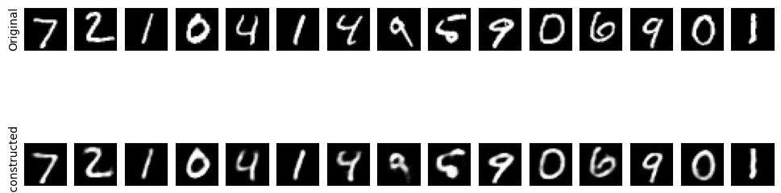
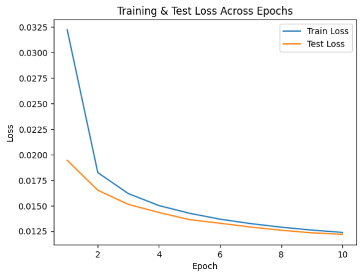
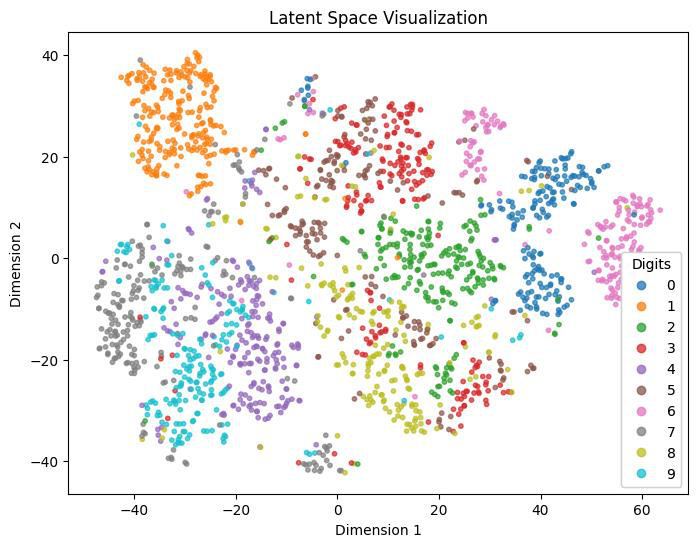
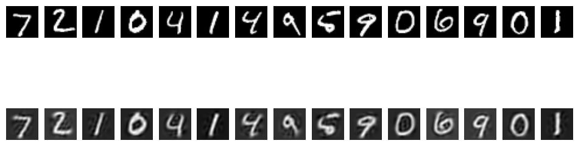
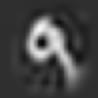
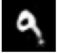
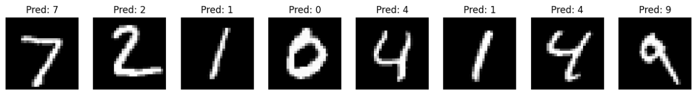

> Γιάννης Καραβέλλας 4228
>
> 3Η ΥΠΟΧΡΕΟΤΙΚΗ ΕΡΓΑΣΙΑ ΣΤΟ ΜΑΘΗΜΑ
>
> «ΝΕΥΡΩΝΙΚΑ ΔΙΚΤΥΑ -- ΒΑΘΙΑ ΜΑΘΗΣΗ»
>
> Στην παρούσα εργασία θα ασχοληθώ με την εφαρμογή **autoencoders** στα
> δεδομένα του **MNIST**. Στη συνέχεια, θα υλοποιήσω ένα **NN** για την
> κατηγοριοποίηση των δεδομένων του CIFAR-10, χρησιμοποιώντας τρεις
> διαφορετικές εισόδους:\
> 1.Το αρχικό σύνολο δεδομένων CIFAR-10 (χωρίς καμία επεξεργασία).

2.Το ανακατασκευασμένο σύνολο δεδομένων που θα παραχθεί από τους
autoencoders.

3.Το ανακατασκευασμένο σύνολο δεδομένων που θα παραχθεί μέσω της μεθόδου
PCA

> Στόχος της εργασίας είναι η σύγκριση των αποτελεσμάτων ταξινόμησης του
> NN και η αξιολόγηση της απόδοσής του στις τρεις διαφορετικές
> περιπτώσεις.
>
> Υλοποίηση και Evaluation Autoencoder\
> Η υλοποίηση θα επιτευχθεί με την βοήθεια του PyTorch Framework. Μετά
> από τον ορισμό και την κανονικοποίηση του train και test σετ, ορίζω
> τον autoencoder:\
> classAutoencoder(nn.Module):\
> def\_\_init\_\_(self, input_dim=784, hidden_dim=128, latent =32):
> super(Autoencoder,self).\_\_init\_\_()\
> \# Encoder\
> self.encoder = nn.Sequential(\
> nn.Linear(input_dim, hidden_dim),\
> nn.ReLU(True),\
> nn.Linear(hidden_dim, latent),\
> nn.ReLU(True),\
> )\
> \# Decoder\
> self.decoder = nn.Sequential(\
> nn.Linear(latent, hidden_dim),\
> nn.ReLU(True),\
> nn.Linear(hidden_dim, input_dim),\
> nn.Sigmoid()\
> )\
> defforward(self, x):\
> \# Flatten the image into a vector\
> x = x.view(x.size(0),-1)\
> encoded = self.encoder(x)\
> decoded = self.decoder(encoded)\
> \# Reshape\
> decoded = decoded.view(x.size(0),1,28,28)\
> return decoded
>
> Γιάννης Καραβέλλας 4228
>
> • **def\_\_init\_\_**: Αρχικοποιεί τα επίπεδα του μοντέλου\
> o**input_dim=784**: Το μέγεθος της εισόδου (οι επίπεδες 28x28
> εικόνες).
>
> o**hidden_dim=128**: Μέγεθος του κρυφού στρώματος.
>
> o**latent=32**: Διαστάσεις bottleneck\
> •Ορισμός της αρχιτεκτονικής του encoder\
> o**nn.Linear(input_dim, hidden_dim)**:Γραμμική μετατροπή από το input
> στο κρυφό στρώμα.
>
> o**nn.ReLU(True)**: Συνάρτηση ενεργοποίησης.
>
> o**nn.Linear(hidden_dim, latent)**: μετατροπή από το κρυφό στρώμα στo
> bottleneck.
>
> o**nn.ReLU(True)**: Συνάρτηση ενεργοποίησης.
>
> •Ορισμός της αρχιτεκτονικής του decoder\
> o**nn.Linear(latent, hidden_dim)**:μετατροπή από το bottleneck στο
> κρυφό στρώμα του decoder.
>
> o**nn.ReLU(True)**: Συνάρτηση ενεργοποίησης.
>
> o**nn.Linear(hidden_dim, input_dim**: μετατροπή από το κρυφό στρώμα
> στην "έξοδο".
>
> o**nn.Sigmoid():**Περιορισμός των τιμών σε \[0,1\]\
> • **defforward(self, x):** Ορισμός διαδικασίας διέλευσης στο μοντέλο.
>
> o**x = x.view(x.size(0), -1):**Μετατροπή εικόνας σε επίπεδη
> μορφήo**encoded =self**.**encoder(x):**Διέλευση μέσω του encoder που
> ορίσαμε.
>
> o**decoded =self.decoder(encoded)** Διέλευση μέσω του decoder που
> ορίσαμε.
>
> oΕπαναφορά των εικόνων στην αρχική τους μορφή.
>
> Έπειτα, ορίζω την συνάρτηση για την εκπαίδευση:

+-----------------------------------------------------------------------+
| > deftrain_autoencoder(model, train_loader, num_epochs,               |
| > learning_rate,                                                      |
+=======================================================================+
+-----------------------------------------------------------------------+

+-----------------------------------------------------------------------+
| > device):                                                            |
+=======================================================================+
+-----------------------------------------------------------------------+

+-----------------------------------------------------------------------+
| > model.to(device)                                                    |
+=======================================================================+
+-----------------------------------------------------------------------+

+-----------------------------------------------------------------------+
| > \# Define the loss function and the optimizer                       |
+=======================================================================+
+-----------------------------------------------------------------------+

> criterion = nn.MSELoss()

+-----------------------------------------------------------------------+
| > optimizer = optim.Adam(model.parameters(), lr=learning_rate)        |
+=======================================================================+
+-----------------------------------------------------------------------+

+-----------------------------------------------------------------------+
| > for epoch inrange(num_epochs):                                      |
+=======================================================================+
+-----------------------------------------------------------------------+

> model.train()

+-----------------------------------------------------------------------+
| > running_loss = 0.0                                                  |
+=======================================================================+
+-----------------------------------------------------------------------+

+-----------------------------------------------------------------------+
| > for images, \_ in train_loader:                                     |
+=======================================================================+
+-----------------------------------------------------------------------+

> images = images.to(device)
>
> \# Forward pass
>
> outputs = model(images)
>
> loss = criterion(outputs, images)
>
> \# Backward pass
>
> optimizer.zero_grad()

+-----------------------------------------------------------------------+
| > loss.backward()                                                     |
+=======================================================================+
+-----------------------------------------------------------------------+

> Γιάννης Καραβέλλας 4228

+-----------------------------------------------------------------------+
| > optimizer.step()                                                    |
+=======================================================================+
+-----------------------------------------------------------------------+

+-----------------------------------------------------------------------+
| > running_loss += loss.item() \* images.size(0)                       |
+=======================================================================+
+-----------------------------------------------------------------------+

+-----------------------------------------------------------------------+
| > epoch_loss = running_loss / len(train_loader.dataset)               |
+=======================================================================+
+-----------------------------------------------------------------------+

+-----------------------------------------------------------------------+
| > print(f\"Epoch \[{epoch+1}/{num_epochs}\], Loss:                    |
| > {epoch_loss:.4f}\")                                                 |
+=======================================================================+
+-----------------------------------------------------------------------+

> •Ορισμός της συνάρτησης κόστους ως MSE.
>
> •Ορισμός του optimizer ως Adam, με καθορισμένο ρυθμό μάθησης.
>
> •Βρόγχος εκπαίδευσης για κάθε εποχή:\
> oΓια κάθε batch εικόνων του DataLoader:\
> ▪ **outputs = model(images) :**Λήψη προβλέψεων.
>
> ▪ **loss = criterion(outputs, images):**Υπολογισμός του σφάλματος\
> ▪ **loss.backward():**Υπολογισμός gradients μέσω backpropagation.
>
> ▪ **optimizer.step():**Ενημέρωση των βαρών\
> ▪Υπολογίζω τα σφάλματα εποχής\
> oΥπολογίζω τον μέσο όρο σφάλματος της εποχής, εμφανίζοντας το.
>
> Παράδειγμα δημιουργίας και εκπαίδευσης μοντέλου:

+-----------------------------------------------------------------------+
| > device = torch.device(\"cuda\"if                                    |
| > torch.cuda.is_available()else\"cpu\")                               |
+=======================================================================+
+-----------------------------------------------------------------------+

+-----------------------------------------------------------------------+
| > model = Autoencoder(input_dim=784, hidden_dim=128, latent =32)      |
+=======================================================================+
+-----------------------------------------------------------------------+

+-----------------------------------------------------------------------+
| > train_autoencoder(model, train_loader, num_epochs=20,               |
| > learning_rate=1e-3,                                                 |
+=======================================================================+
+-----------------------------------------------------------------------+

+-----------------------------------------------------------------------+
| > device=device)                                                      |
+=======================================================================+
+-----------------------------------------------------------------------+

> Παραδείγματα εκτέλεσης\
> [Hyperparameters]{.underline} •num_epochs=10
> {width="0.4861111111111111in"
> height="0.3125in"}
>
> •learning_rate=0.001 •hidden_dim=128\
> •latent=32
>
> {width="2.8569444444444443in"
> height="2.2263877952755906in"}

{width="7.075in"
height="1.7541655730533683in"}

Γιάννης Καραβέλλας 4228

Train Loss: 0.0103

Test Loss: 0.0099
{width="3.0791666666666666in"
height="2.363888888888889in"}

[Hyperparameters]{.underline}\
•num_epochs=10 •learning_rate=0.001
{width="0.4861111111111111in"
height="0.3125in"}

> •hidden_dim=256\
> •latent=16

{width="6.586111111111111in"
height="1.6347211286089238in"}

Με την χρήση t-SNE, μειώνω τις διαστάσεις του latent (32), σε 2D ώστε να
μπορώ να οπτικοποιήσω ένα δείγμα των encoded δειγμάτων μου.

> {width="4.847222222222222in"
> height="3.7916655730533684in"}

Με βάση το γράφημα, μπορούμε να διακρίνουμε κάποια clusters.

{width="0.8222211286089239in"
height="0.20424650043744533in"}{width="6.501388888888889in"
height="3.4468121172353454in"}

> Γιάννης Καραβέλλας 4228
>
> Deep Autoencoder\
> Αν και η ανακατασκευή σε ορισμένες εισόδους είναι καλές, θα υλοποιήσω
> autoencoder, με περισσότερα hidden layers. Υλοποιώ νέα κλάση
> **DeeperAutoencoder,** με την παρακάτω αρχιτεκτονική
>
> Αλλαγμένη αρχιτεκτονική:\
> self.encoder =nn.Sequential(\
> nn.Linear(784,512),\
> nn.ReLU(True),\
> nn.Linear(512,256),\
> nn.ReLU(True),\
> nn.Linear(256,64),\
> nn.ReLU(True)

+-----------------------------------------------------------------------+
| > )                                                                   |
+=======================================================================+
+-----------------------------------------------------------------------+

+-----------------------------------------------------------------------+
| > self.decoder =nn.Sequential(                                        |
+=======================================================================+
+-----------------------------------------------------------------------+

> nn.Linear(64,256),\
> nn.ReLU(True),\
> nn.Linear(256,512),\
> nn.ReLU(True),\
> nn.Linear(512,784),\
> nn.Sigmoid()\
> )\
> Mε νέο latent_size=64
>
> [hyperparameters]{.underline}\
> •num_epochs=20\
> •learning_rate=0.001
>
> Γιάννης Καραβέλλας 4228
>
> Train Loss: 0.0045 Test Loss: 0.0047
>
> Με την νέα αρχιτεκτονική οι ανακατασκευασμένες εικόνες είναι πιο κοντά
> στις original. Αυτό το γεγονός επιβεβαιώνεται συγκρίνοντας το loss των
> διαφορετικών μοντέλων. Επίσης, έχουμε πιο διακριτά clusters στο Latent
> space.

{width="4.383333333333334in"
height="3.4291666666666667in"}

> Υλοποιώ συνάρτηση για το evaluation των autoencoders, παράγοντας το
> MSE loss για κάθε κλάση (0-9) του test set:\
> defevaluate_autoencoder(model, test_loader, device=\'cpu\'):
>
> model.eval()
>
> criterion =nn.MSELoss()

+-----------------------------------------------------------------------+
| > running_test_loss =0.0                                              |
+=======================================================================+
+-----------------------------------------------------------------------+

+-----------------------------------------------------------------------+
| > \# Dictionary to store loss per digit                               |
+=======================================================================+
+-----------------------------------------------------------------------+

+-----------------------------------------------------------------------+
| > digit_loss ={i:{\'total_loss\':0.0,\'count\':0}for i inrange(10)}   |
+=======================================================================+
+-----------------------------------------------------------------------+

+-----------------------------------------------------------------------+
| > withtorch.no_grad():                                                |
+=======================================================================+
+-----------------------------------------------------------------------+

> for images, labels in test_loader:

+-----------------------------------------------------------------------+
| > images = images.to(device)                                          |
+=======================================================================+
+-----------------------------------------------------------------------+

+-----------------------------------------------------------------------+
| > \# Get reconstructions                                              |
+=======================================================================+
+-----------------------------------------------------------------------+

+-----------------------------------------------------------------------+
| > outputs = model(images)                                             |
+=======================================================================+
+-----------------------------------------------------------------------+

> Γιάννης Καραβέλλας 4228
>
> loss = criterion(outputs,images)\
> running_test_loss += loss.item()\* images.size(0)
>
> \# Calculate loss per digit class\
> for img, label, output inzip(images,labels,outputs):\
> img = img.unsqueeze(0)# Add batch dimension\
> output = output.unsqueeze(0)\
> digit_loss\[label.item()\]\[\'total_loss\'\]+=
> criterion(output,img).item()\* img.size(0)
> digit_loss\[label.item()\]\[\'count\'\]+= img.size(0)
>
> \# Calculate average loss exactly as in training loop\
> avg_test_loss = running_test_loss /len(test_loader.dataset)
>
> \# Calculate average loss per digit\
> digit_avg_loss ={digit: info\[\'total_loss\'\]/ info\[\'count\'\]\
> for digit, info in digit_loss.items()}
>
> print(f\"\\nOverall Test Set Loss: {avg_test_loss:.6f}\")\
> print(\"\\nLoss per digit:\")\
> for digit, loss in digit_avg_loss.items():\
> print(f\"Digit {digit}: {loss:.6f}\")
>
> return avg_test_loss, digit_avg_loss
>
> • criterion = nn.MSELoss(): Ορίζω το ίδιο loss function που
> χρησιμοποιήθηκε στο training του autoencoder.
>
> • running_test_loss: Μετρά τη συνολική απώλεια στο test set.
>
> • digit_loss: καταγράφει τη συνολική απώλεια και τον αριθμό των
> δειγμάτων για κάθε ψηφίο (κλάση).
>
> •Μπαίνω σε βρόχο για κάθε batch των εικόνων (64) με το label τους: o
> outputs = model(images): περνώ της εικόνες από το autoencoder.
>
> o loss = criterion(outputs, images): Υπολογίζω το loss\
> oΠροσθέτο στο running_test_loss\
> oΓια κάθε εικόνα, label και aνακατασκευασμένη εικόνα στο batch:\
> ▪Το unsqueeze(0), Προσθέτει διάσταση του batch στις εικόνες\
> ▪Υπολογίζεται η απώλεια για το συγκεκριμένο ψηφίο και ενημερώνονται τα
> αντίστοιχα πεδία στον πίνακαdigit_loss.
>
> avg_test_loss: Υπολογίζει η συνολική μέση απώλεια για όλα τα
> δείγματα.•

Γιάννης Καραβέλλας 4228

> • digit_avg_loss: Για κάθε ψηφίο, υπολογίζω την συνολική του απώλεια
> με βάση τον αριθμό των δειγμάτων κάθε ψηφίου.

Evaluation\
Εδώ θα κάνω evaluate τα δύο μοντέλα που υλοποίησα:

Basic Autoencoder

+-----------------------------------+-----------------------------------+
| Overall Test Set Loss: 0.009948   | > {width="4.256944444444445in" |
| Loss per digit:\                  | > height="2.320832239720035in"}   |
| Digit 0: 0.009950\                |                                   |
| Digit 1: 0.002676\                |                                   |
| Digit 2: 0.014137\                |                                   |
| Digit 3: 0.011043\                |                                   |
| Digit 4: 0.010337\                |                                   |
| Digit 5: 0.012149                 |                                   |
+===================================+===================================+
+-----------------------------------+-----------------------------------+

Digit 6: 0.010880\
Digit 7: 0.007581\
Digit 8: 0.014230\
Digit 9: 0.007815

+-----------------------------------+-----------------------------------+
| > Γιάννης Καραβέλλας              | 4228                              |
| >                                 |                                   |
| > Deeper Autoencoder              | > {width="4.205555555555556in" |
| > Overall Test Set Loss: 0.005021 | > height="2.2930555555555556in"}  |
| >                                 |                                   |
| > Loss per digit:\                |                                   |
| > Digit 0: 0.005951\              |                                   |
| > Digit 1: 0.001576\              |                                   |
| > Digit 2: 0.006838\              |                                   |
| > Digit 3: 0.005549\              |                                   |
| > Digit 4: 0.004908\              |                                   |
| > Digit 5: 0.006016               |                                   |
+===================================+===================================+
+-----------------------------------+-----------------------------------+

> Digit 6: 0.005277
>
> Digit 7: 0.003877
>
> Digit 8: 0.006864
>
> Digit 9: 0.003982
>
> Με βάση τα αποτελέσματα, είναι φανερό πως και τα δύο μοντέλα
> δυσκολεύονται περισσότερο στην ανακατασκευή των ψηφίων 0,2,5,8 σε
> σύγκριση με το ψηφίο 1
>
> Υλοποίηση PCA\
> Θα υλοποιήσω PCA για την μείωση των διαστάσεων των εικόνων σε 64, ώστε
> να είναι άμεσα συγκρίσιμο με το μοντέλο του **DeeperAutoencoder,** που
> το bottleneck του έχει size=64.
>
> defdataset_to_numpy(dataset):
>
> all_images =\[\]

+-----------------------------------------------------------------------+
| > all_labels =\[\]                                                    |
+=======================================================================+
+-----------------------------------------------------------------------+

> for img, label in dataset:
>
> arr =np.array(img,dtype=np.float32).reshape(-1)# flatten to 784

+-----------------------------------------------------------------------+
| > all_images.append(arr)                                              |
+=======================================================================+
+-----------------------------------------------------------------------+

+-----------------------------------------------------------------------+
| > all_labels.append(label)                                            |
+=======================================================================+
+-----------------------------------------------------------------------+

+-----------------------------------------------------------------------+
| > \# Stack into \[N, 784\]                                            |
+=======================================================================+
+-----------------------------------------------------------------------+

+-----------------------------------------------------------------------+
| > all_images =np.stack(all_images,axis=0)                             |
+=======================================================================+
+-----------------------------------------------------------------------+

+-----------------------------------------------------------------------+
| > all_labels =np.array(all_labels,dtype=np.int64)                     |
+=======================================================================+
+-----------------------------------------------------------------------+

+-----------------------------------------------------------------------+
| > return all_images, all_labels                                       |
+=======================================================================+
+-----------------------------------------------------------------------+

> Αυτή η συνάρτηση μετατρέπει το σύνολο δεδομένων MNIST σε μορφή NumPy.
> Κάθε εικόνα μετατρέπεται σε μονοδιάστατο πίνακα με 784 στοιχεία.
>
> Γιάννης Καραβέλλας 4228

+-----------------------------------------------------------------------+
| > pca =PCA(n_components=64)# match autoencoder\'s bottleneck          |
| > dimension                                                           |
+=======================================================================+
+-----------------------------------------------------------------------+

+-----------------------------------------------------------------------+
| > pca.fit(train_images_np)                                            |
+=======================================================================+
+-----------------------------------------------------------------------+

+-----------------------------------------------------------------------+
| > \# Transform and reconstruct test images                            |
+=======================================================================+
+-----------------------------------------------------------------------+

+-----------------------------------------------------------------------+
| > test_comp = pca.transform(test_images_np)                           |
+=======================================================================+
+-----------------------------------------------------------------------+

+-----------------------------------------------------------------------+
| > test_recon = pca.inverse_transform(test_comp)                       |
+=======================================================================+
+-----------------------------------------------------------------------+

> pca = PCA(n_components=64): Ορίζω πως το PCA θα μειώσει τη διάσταση
> των εικόνων από 784

+-----------------------------------+-----------------------------------+
| > ▪                               | > σε 64.                          |
|                                   | >                                 |
|                                   | > pca.fit(train_images_np):       |
|                                   | > Υπολογίζω τις principal         |
|                                   | > components με βάση το train     |
|                                   | > set.                            |
+===================================+===================================+
+-----------------------------------+-----------------------------------+

> ▪Μετασχηματίζω τις εικόνες στις 64 διαστάσεις ▪Ανακατασκευάζω πίσω
> στην αρχική διαστση.
>
> Evaluation του PCA
>
> Για την σωστή σύγκριση του MSE loss του PCA και των autoencoders θα
> πρέπει να υλοποιήσω συνάρτηση για το evaluation του PCA όμοιο με αυτό
> των autoencoders:\
> defcalculate_pca_mse(original_images, reconstructed_images):

+-----------------------------------------------------------------------+
| > running_loss =0.0                                                   |
+=======================================================================+
+-----------------------------------------------------------------------+

+-----------------------------------------------------------------------+
| > total_samples =len(original_images)                                 |
+=======================================================================+
+-----------------------------------------------------------------------+

+-----------------------------------------------------------------------+
| > \# Convert to PyTorch tensors to use the same MSE calculation       |
+=======================================================================+
+-----------------------------------------------------------------------+

> original_tensor =torch.FloatTensor(original_images)# Keep as flattened

+-----------------------------------------------------------------------+
| > reconstructed_tensor =torch.FloatTensor(reconstructed_images)# Keep |
| > as flattened                                                        |
+=======================================================================+
+-----------------------------------------------------------------------+

+-----------------------------------------------------------------------+
| > \# Use the same criterion as in autoencoder                         |
+=======================================================================+
+-----------------------------------------------------------------------+

+-----------------------------------------------------------------------+
| > criterion =nn.MSELoss()                                             |
+=======================================================================+
+-----------------------------------------------------------------------+

+-----------------------------------------------------------------------+
| > \# Calculate loss batch by batch to match autoencoder\'s            |
| > calculation                                                         |
+=======================================================================+
+-----------------------------------------------------------------------+

> batch_size =64# Same as autoencoder
>
> for i inrange(0,total_samples,batch_size):
>
> batch_end =min(i+batch_size,total_samples)
>
> batch_original = original_tensor\[i:batch_end\]

+-----------------------------------------------------------------------+
| > batch_reconstructed = reconstructed_tensor\[i:batch_end\]           |
+=======================================================================+
+-----------------------------------------------------------------------+

+-----------------------------------------------------------------------+
| > loss = criterion(batch_reconstructed,batch_original)                |
+=======================================================================+
+-----------------------------------------------------------------------+

> running_loss += loss.item()\* batch_original.size(0)

+-----------------------------------+-----------------------------------+
| > Γιάννης Καραβέλλας              | 4228                              |
+===================================+===================================+
+-----------------------------------+-----------------------------------+

+-----------------------------------------------------------------------+
| > \# Calculate final average loss                                     |
+=======================================================================+
+-----------------------------------------------------------------------+

+-----------------------------------------------------------------------+
| > avg_loss = running_loss / total_samples                             |
+=======================================================================+
+-----------------------------------------------------------------------+

+-----------------------------------------------------------------------+
| > return avg_loss                                                     |
+=======================================================================+
+-----------------------------------------------------------------------+

> ▪Μετατρέπω τις εικόνες σε PyTorch tensors για να χρησιμοποιηθεί
> η**nn.MSELoss**όπως και στους encoders ( επίπεδες εικόνες )
>
> ▪criterion = nn.MSELoss(), ορίζω το ίδιο loss function όπως και πρίν.
>
> ▪Βρόχος για batch εικονών (64):
>
> o criterion(batch_reconstructed, batch_original): Υπολογίζω το MSE για
> το batch.
>
> oΠροσθέτω το συνολικό loss του batch, πολλαπλασιασμένο με το μέγεθος
> του batch.▪Υπολογίζω το συνολικό loss.
>
> Αποτελέσματα
>
> {width="0.6944444444444444in"
> height="0.2055544619422572in"}

{width="6.5in"
height="1.6458333333333333in"}

> PCA Test MSE: 0.009047
>
> Είναι εμφανές πως ο τρόπος ανακατασκευής με τον **DeeperAutoencoder**
> παράγει καλύτερα αποτελέσματα από τον PCA, αυτό είναι εμφανές και από
> το loss τους ( 0.005021\<0.009047).
>
> H σύγκριση του PCA με τον Basic Autoencoder είναι αρκετά ενδιαφέρον:
>
> {width="0.7777777777777778in"
> height="0.6944444444444444in"}
> {width="0.6805555555555556in"
> height="0.6805555555555556in"}

*Basic Autoencoder*

*PCA*

> Συγκρίνοντας αυστηρά τα loss τους είναι αρκετά όμοια ( 0.009047 και
> 0.009948,) με το PCA να «υπερτερεί». Η ανακατασκευή του PCA φαίνεται
> πιο «θολή» άλλα κρατά τις γωνιές των ψηφίων πιο αποδοτικά. To Basic
> Autoencoder έχει μέγεθος του bottleneck 32 και το PCA 64,\
> Ακολουθά ο υπολογισμός του loss αν ορίσω τον latent_size του
> autoencoder σε 64.
>
> Γιάννης Καραβέλλας 4228
>
> Overall Test Set Loss: 0.006343

{width="0.7916666666666666in"
height="0.7361111111111112in"}

*Basic Autoencoder*

> {width="0.6805555555555556in"
> height="0.6805555555555556in"}

*PCA*

> Αυξάνοντας το latenet_size, παράγονται πολύ καλύτερα αποτελέσματα. Με
> βάση των αποτελεσμάτων του PCA και των δύο μοντέλων των autoencoders
> για την μείωση και την ανακατασκευή σε ίδιο αριθμό διαστάσεων, η
> τεχνική των autoencoders καθηστάτε πιο ισχυρή. Επίσης αξίζει να
> σημειωθεί πως η ποιότητα της ανακατασκευής είναι εξαιρετικά ευπαθής
> στο μέγεθος του bottleneck και τον αριθμό των components ανάλογα με
> την τεχνική.
>
> CNN\
> Θα υλοποιήσω ένα απλό CNN εκπαιδευμένο στο original MNIST data, ώστε
> να συγκρίνω το classification accuracy ανάμεσα στο αρχικό dataset,
> dataset ανακατασκευασμένο από autoencoder και dataset
> ανακατασκευασμένο από PCA.
>
> Αρχιτεκτονική του CNN με AdamOptimizer και CrossEntropyLoss
> classCNN(nn.Module):\
> def\_\_init\_\_(self, num_classes=10):\
> super(CNN,self).\_\_init\_\_()\
> \# Convolutional layers\
> self.conv1 =nn.Sequential(\
> nn.Conv2d(in_channels=1,out_channels=32,kernel_size=3,stride=1,padding=1),
> nn.ReLU(),\
> nn.MaxPool2d(kernel_size=2,stride=2\
> )\
> self.conv2 =nn.Sequential(\
> nn.Conv2d(in_channels=32,out_channels=64,kernel_size=3,stride=1,padding=1),
> nn.ReLU(),\
> nn.MaxPool2d(kernel_size=2,stride=2)
>
> Γιάννης Καραβέλλας 4228

+-----------------------------------------------------------------------+
| > )                                                                   |
+=======================================================================+
+-----------------------------------------------------------------------+

+-----------------------------------------------------------------------+
| > \# Fully connected layers                                           |
+=======================================================================+
+-----------------------------------------------------------------------+

> self.fc1 =nn.Linear(64\*7\*7,128)
>
> self.relu =nn.ReLU()

+-----------------------------------------------------------------------+
| > self.fc2 =nn.Linear(128,num_classes)                                |
+=======================================================================+
+-----------------------------------------------------------------------+

+-----------------------------------------------------------------------+
| > defforward(self, x):                                                |
+=======================================================================+
+-----------------------------------------------------------------------+

> \# Pass input through the convolutional layers\
> x =self.conv1(x)

+-----------------------------------------------------------------------+
| > x =self.conv2(x)                                                    |
+=======================================================================+
+-----------------------------------------------------------------------+

+-----------------------------------------------------------------------+
| > \# Flatten                                                          |
+=======================================================================+
+-----------------------------------------------------------------------+

+-----------------------------------------------------------------------+
| > x = x.view(x.size(0),-1)                                            |
+=======================================================================+
+-----------------------------------------------------------------------+

+-----------------------------------------------------------------------+
| > \# Pass through fully connected layers                              |
+=======================================================================+
+-----------------------------------------------------------------------+

> x =self.fc1(x)
>
> x =self.relu(x)

+-----------------------------------------------------------------------+
| > x =self.fc2(x)                                                      |
+=======================================================================+
+-----------------------------------------------------------------------+

+-----------------------------------------------------------------------+
| > return x                                                            |
+=======================================================================+
+-----------------------------------------------------------------------+

> Μετά το training:

{width="5.8027766841644794in"
height="2.393054461942257in"}

> Η τελευταία εποχή στην εκπαίδευση έδωσε τα παρακάτω αποτελέσματα:
>
> Epoch \[10/10\], Train Loss: 0.0078, Train Acc: 99.74%, Test Loss:
> 0.0431, Test Acc: 98.89%
>
> Γιάννης Καραβέλλας 4228
>
> Παραδείγματα classification:

{width="6.5in"
height="0.8986111111111111in"}

> model_deep.eval()

+-----------------------------------------------------------------------+
| > model_cnn_classifier.eval()                                         |
+=======================================================================+
+-----------------------------------------------------------------------+

> defaccuracy(preds, labels):\
> \_, predicted =torch.max(preds,1)\
> return(predicted == labels).float().mean()

+-----------------------------------------------------------------------+
| > criterion =nn.CrossEntropyLoss()                                    |
+=======================================================================+
+-----------------------------------------------------------------------+

test_running_loss =0.0\
test_running_acc =0.0

> withtorch.no_grad():\
> for images, labels in test_loader:\
> images, labels = images.to(device), labels.to(device)

+-----------------------------------------------------------------------+
| > outputs = model_cnn_classifier(images)                              |
+=======================================================================+
+-----------------------------------------------------------------------+

> \# Compute loss and accuracy\
> loss = criterion(outputs,labels)\
> test_running_loss += loss.item()

+-----------------------------------------------------------------------+
| > test_running_acc +=accuracy(outputs,labels).item()                  |
+=======================================================================+
+-----------------------------------------------------------------------+

+-----------------------------------------------------------------------+
| > avg_test_loss = test_running_loss /len(test_loader)                 |
+=======================================================================+
+-----------------------------------------------------------------------+

> avg_test_acc = test_running_acc /len(test_loader)
>
> print(f\"Classification on Images - \"\
> f\"Loss: {avg_test_loss:.4f}, Acc: {avg_test_acc\*100:.2f}%\")
>
> Γιάννης Καραβέλλας 4228
>
> Μετά την εκπαίδευση, χρησιμοποιώ το εκπαιδευμένο μοντέλο για
> evaluation. Θέτω τα μοντέλα σε λειτουργία αξιολόγησης με.eval()και για
> κάθε batch του test set, υπολογίζω τις προβλέψεις
>
> και το loss χρησιμοποιώντας τηνCrossEntropyLoss. Η ακρίβεια
> υπολογίζεται συγκρίνοντας τις
>
> προβλέψεις με τις πραγματικές ετικέτες. Αθροίζω τις απώλειες και την
> ακρίβεια όλων των batches, και τελικά εμφανίζω τη μέση απώλεια και την
> ακρίβεια σε ποσοστό.
>
> Classification on Images - Loss: 0.0431, Acc: 98.89%
>
> CNN classification using the autoencoder model
>
> Εδώ η είσοδος του CNN για classification, δεν είναι οι original
> εικόνες, αλλά οι
>
> ανακατασκευασμένες εικόνες του **DeeperAutoencoder** μοντέλου. Η μόνη
> διαφορά στον
>
> κώδικα του evaluation είναι:

+-----------------------------------------------------------------------+
| > \# Reconstruct the images using the autoencoder                     |
+=======================================================================+
+-----------------------------------------------------------------------+

+-----------------------------------------------------------------------+
| > recon_images = model_deep(images)                                   |
+=======================================================================+
+-----------------------------------------------------------------------+

+-----------------------------------------------------------------------+
| > \# Classify the reconstructed images                                |
+=======================================================================+
+-----------------------------------------------------------------------+

+-----------------------------------------------------------------------+
| > outputs = model_cnn_classifier(recon_images)                        |
+=======================================================================+
+-----------------------------------------------------------------------+

> Κάνω reconstruct τις εικόνες με το pre-trained μοντέλο
> **DeeperAutoencoder** και τις περνώ από
>
> τον classifier.
>
> Αποτελέσματα:\
> Classification on Reconstructed Images - Loss: 0.0745, Acc: 98.27%
>
> CNN classification using the PCA model\
> Για να μπορώ να ορίσω είσοδο στον classifier, δημιουργώ ένα Dataset
> και ένα DataLoader, με τις ανακατασκευασμένες εικόνες του PCA σε μορφή
> torch.tensor.

+-----------------------------------------------------------------------+
| > classPCATestDataset(Dataset):                                       |
+=======================================================================+
+-----------------------------------------------------------------------+

+-----------------------------------------------------------------------+
| > def\_\_init\_\_(self, images_2d, labels):                           |
+=======================================================================+
+-----------------------------------------------------------------------+

+-----------------------------------------------------------------------+
| > self.images = images_2d                                             |
+=======================================================================+
+-----------------------------------------------------------------------+

+-----------------------------------------------------------------------+
| > self.labels = labels                                                |
+=======================================================================+
+-----------------------------------------------------------------------+

+-----------------------------------------------------------------------+
| > def\_\_len\_\_(self):                                               |
+=======================================================================+
+-----------------------------------------------------------------------+

+-----------------------------------------------------------------------+
| > returnlen(self.images)                                              |
+=======================================================================+
+-----------------------------------------------------------------------+

+-----------------------------------------------------------------------+
| > def\_\_getitem\_\_(self, idx):                                      |
+=======================================================================+
+-----------------------------------------------------------------------+

> Γιάννης Καραβέλλας 4228
>
> \# Get flattened data of shape 784

+-----------------------------------------------------------------------+
| > x =self.images\[idx\]                                               |
+=======================================================================+
+-----------------------------------------------------------------------+

> label =self.labels\[idx\]
>
> \# Reshape from 784 to 1, 28, 28

+-----------------------------------------------------------------------+
| > x = x.reshape(1,28,28)                                              |
+=======================================================================+
+-----------------------------------------------------------------------+

> \# Convert to torch tensor
>
> x_tensor =torch.tensor(x,dtype=torch.float32)
>
> label_tensor =torch.tensor(label,dtype=torch.long)

+-----------------------------------------------------------------------+
| > return x_tensor, label_tensor                                       |
+=======================================================================+
+-----------------------------------------------------------------------+

+-----------------------------------------------------------------------+
| > \# Create a test dataset and loader for PCA-reconstructed images    |
+=======================================================================+
+-----------------------------------------------------------------------+

> pca_test_dataset =PCATestDataset(test_recon,test_labels_np)
>
> pca_test_loader
> =DataLoader(pca_test_dataset,batch_size=64,shuffle=False)
>
> Κάνοντας classify το pca_test_loader,παίρνω τα παρακάτω αποτελέσματα:
>
> Classification on Reconstructed Images - Loss: 0.0564, Acc: 98.22%
>
> Συμπεράσματα
>
> Ο DeeperAutoencoder παρουσιάζει καλύτερα αποτελέσματα στην
> ανακατασκευή εικόνων σε σχέση με τον Basic Autoencoder και τον PCA,
> όπως αποδεικνύεται από το σφάλμα ανακατασκευής (MSE). Οι εικόνες που
> παράγονται από τον DeeperAutoencoder είναι πιο κοντά στις αρχικές και
> δημιουργούν πιο διακριτά clusters στον latent χώρο. Επίσης, δείξαμε
> πως η ποιότητα της ανακατασκευής επηρεάζεται σημαντικά από το μέγεθος
> του bottleneck και αλλά όχι τόσο από την πολυπλοκότητα της
> αρχιτεκτονικής του μοντέλου. Η τεχνική των autoencoders είναι πιο
> ισχυρή από το PCA για ανακατασκευή εικόνων, ειδικά όταν το bottleneck
> size είναι ίσο.
>
> Το CNN πέτυχε υψηλή ακρίβεια στην κατηγοριοποίηση του αρχικού MNIST
> dataset (98.89%).Οι ανακατασκευασμένες εικόνες από τον
> DeeperAutoencoder οδήγησαν σε ελαφρώς χαμηλότερη ακρίβεια (98.27%),Η
> χρήση των ανακατασκευασμένων δεδομένων από το PCA για την
> κατηγοριοποίηση παρουσιάζει επίσης ενδιαφέρον αποτελέσματα (98.22%).
> Τα αποτελέσματα των κατηγοριοποιήσεων στις τρείς περιπτώσεις είναι
> εξαιρετικά κοντά με διαφορά σχεδόν αμελητέα. Και οι τρεις μέθοδοι
> (αρχικά δεδομένα, ανακατασκευασμένα από Autoencoders, και PCA)
> φαίνεται να διατηρούν επαρκή πληροφορία για την ταξινόμηση των
> δεδομένων, παρά τη μείωση των διαστάσεων ή την επεξεργασία που
> πραγματοποιήθηκε. Το MNIST dataset είναι σχετικά απλό, με καλά
> διαχωρίσιμα χαρακτηριστικά ανάμεσα στις διαφορετικές κατηγορίες. Αυτή
> η απλότητα διευκολύνει την ταξινόμηση, ανεξάρτητα από την επεξεργασία
> των δεδομένων.
